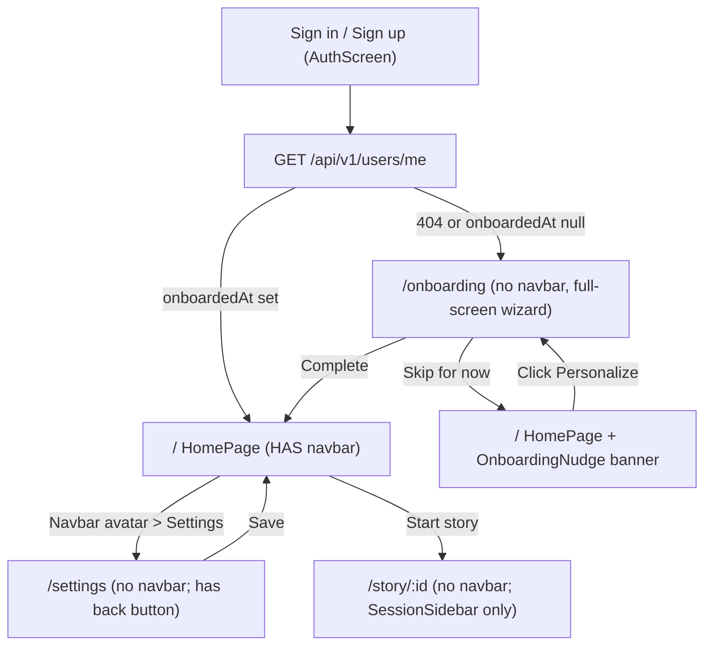
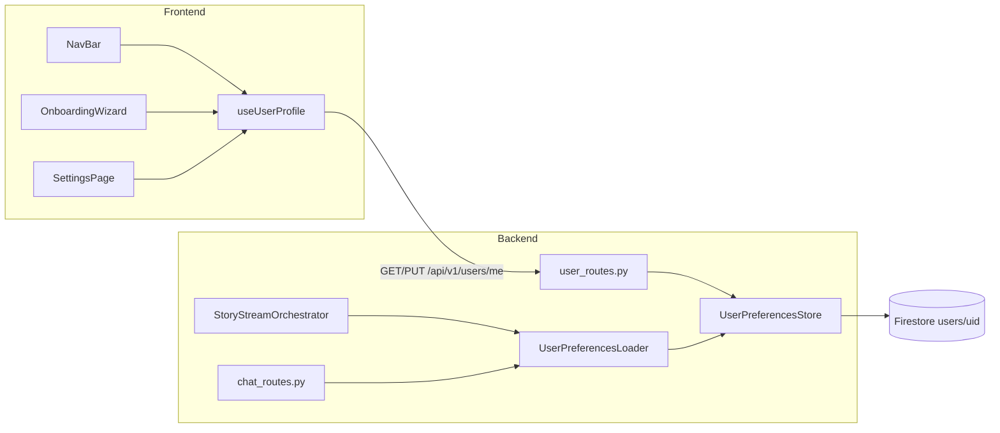

# Personalized Onboarding & Navbar — Software Design Document

> Branch: `feat/personalized_onboarding`. Scope locked with user: **navbar on HomePage (`/`) only** (not on Companion, Story, Settings, or Onboarding pages), **skippable wizard with soft re-prompt banner**. Sign-out / profile access on inner pages continues to live in the existing `SessionSidebar` user block.

---

## 1. Product rationale (PM / co-founder framing)

**Why now.** Elora writes beautiful prose but is tone-deaf to the individual. A 19-year-old who loves Murakami and a 45-year-old who loves Tom Clancy should get very different stories from the same prompt. Today the only personalization lever is the Companion chat (per-session). Persistent preferences turn Elora from a "prompt-in / story-out" toy into a **"storyteller who knows you"** — the single biggest lever on retention and story quality.

**Success metrics (track post-ship).**
- % of new users who complete onboarding (target ≥ 60%)
- Avg preferences filled per user (target ≥ 8 out of ~12 fields)
- Story rating / re-generation rate for personalized vs anonymous stories
- % of users who visit `/settings` within 30 days

**Principles.**
- Low friction: every step skippable, wizard never blocks the app.
- Reversible: everything editable in `/settings`.
- Honest defaults: no preference = no injection (Elora falls back to current behavior).
- Privacy-lean: only collect what demonstrably improves the story.

---

## 2. Scope

In scope:
- Top `NavBar` **on HomePage (`/`) only** — rendered inside `HomePage.tsx`, not the app shell.
- Profile avatar dropdown in the navbar → Profile · Settings · Sign Out.
- `/onboarding` 5-step wizard (skippable at every step + "Skip for now" global). No navbar.
- `/settings` page with tabs: Profile, Story Preferences, Account. No navbar (has its own "Back to Home" header).
- Firestore `users/{uid}` document + backend CRUD + `UserPreferencesLoader` service injecting a Reader Profile preamble into Elora & Companion.
- Soft `OnboardingNudge` banner on HomePage (below the navbar) if user skipped.

Out of scope (explicit non-goals):
- Navbar on `/companion`, `/story/:id`, `/onboarding`, `/settings` (these keep the existing `SessionSidebar` with its user block as the only profile/sign-out surface).
- Public pre-auth marketing landing page.
- Account deletion / data export (tracked as stretch).
- Multi-profile / family accounts.
- A/B-testable onboarding variants.

---

## 3. User flows



The navbar is owned by `HomePage.tsx` and only rendered there. On `/companion`, `/story/:id`, `/onboarding`, and `/settings`, the existing `SessionSidebar` (with its user block and Sign Out button) remains the primary profile surface so users are never stranded.

---

## 4. Preferences — suggested fields (PM recommendation)

The wizard has **2 steps**, each ≤ 3 fields. Everything is optional. Both steps directly shape Elora's output.

**Step 1 — Your literary DNA**
- Favorite genres (multi chip-select): Fantasy · Sci-Fi · Romance · Thriller · Mystery · Literary Fiction · Historical · Magical Realism · Horror · Comedy · Dystopian · YA
- Favorite authors (freeform tag input, up to 5, autocomplete seeded with ~60 popular names)
- Favorite books or series (freeform tags, up to 5)

**Step 2 — The mood you crave**
- Tones (multi): Whimsical · Dark · Hopeful · Melancholic · Epic · Intimate · Philosophical · Adventurous
- Themes (multi): Coming-of-age · Redemption · Love · Grief · Identity · Family · Power · Wonder · Survival · Friendship
- Atmospheres (multi): Enchanted forests · Deep space · Bustling cities · Remote villages · Victorian drawing rooms · Rainy noir streets · Coastal towns · Desert ruins

---

## 5. Architecture



The `UserPreferencesLoader` mirrors the existing [`CompanionContextLoader`](emotional-chronicler/app/services/companion_context_loader.py) pattern — loads Firestore, builds a preamble string, returns a dataclass. Orchestrator prepends both preambles to the user prompt.

---

## 6. Backend changes

### 6.1 Firestore schema — new `users` collection

Document: `users/{uid}`
```
displayName:   string
email:         string
photoURL:      string|null
createdAt:     Timestamp
onboardedAt:   Timestamp|null          # null => show wizard
updatedAt:     Timestamp
preferences: {
  favoriteGenres:   string[]
  favoriteAuthors:  string[]           # max 5
  favoriteBooks:    string[]           # max 5
  tones:            string[]
  themes:           string[]
  atmospheres:      string[]
}
```
No migration needed (new collection, existing users get the wizard on next sign-in because their doc won't exist).

### 6.2 New files

- [`emotional-chronicler/app/core/user_store.py`](emotional-chronicler/app/core/user_store.py) — `UserPreferencesStore` with `get(uid)`, `upsert(uid, profile, preferences)`, `mark_onboarded(uid)`. Mirrors the style of [`app/core/store.py`](emotional-chronicler/app/core/store.py).
- [`emotional-chronicler/app/server/user_routes.py`](emotional-chronicler/app/server/user_routes.py) — router mounted at `/api/v1/users`:
  - `GET /me` → profile + preferences (creates stub doc on first call using Firebase claims if missing).
  - `PUT /me` → full upsert of profile + preferences.
  - `POST /me/onboarding/complete` → sets `onboardedAt = now`, accepts final preferences payload.
  - `POST /me/onboarding/skip` → sets `onboardedAt = now` with empty preferences (so the nudge banner can still appear based on empty-prefs heuristic, but we do not re-block).
- [`emotional-chronicler/app/services/user_preferences_loader.py`](emotional-chronicler/app/services/user_preferences_loader.py) — `UserPreferencesLoader.load(user_id, is_authenticated)` returns a `UserPreferencesContext` dataclass with `preamble: str` and `applied: bool`. Empty preferences → `applied=False`, empty preamble.
- [`emotional-chronicler/app/domain/user.py`](emotional-chronicler/app/domain/user.py) — Pydantic `UserProfile` and `UserPreferences` models (shared with request/response schemas).

### 6.3 Preamble format (Elora)

```
READER PROFILE — tailor tone, themes, setting, and voice to this reader.
Do NOT list these back to the reader.

- Loves: fantasy, literary fiction (genres); Neil Gaiman, Haruki Murakami (authors)
- Favorite books/series: The Ocean at the End of the Lane, Norwegian Wood
- Craves tones: hopeful, intimate
- Themes that resonate: coming-of-age, wonder
- Atmospheres: enchanted forests, coastal towns
```

Only include a line when the field is set; drop the whole preamble if `applied=False`.

### 6.4 Wiring

- [`app/server/routes.py`](emotional-chronicler/app/server/routes.py) — after `CompanionContextLoader.load(...)`, call `UserPreferencesLoader.load(...)` and build the final prompt as:
  ```
  {user_prefs_preamble}\n\n{companion_ctx.prompt_text}
  ```
- [`app/server/chat_routes.py`](emotional-chronicler/app/server/chat_routes.py) — same injection at the start of the Companion conversation (first turn only, or as a system-style block).
- [`app/server/factory.py`](emotional-chronicler/app/server/factory.py) — register the new `user_routes` router.

### 6.5 Security

- All new endpoints use `get_current_user` (auth required).
- Server enforces `uid` from the verified token — client-sent `uid` is ignored.
- Validate preference enums with Pydantic; cap array sizes (`favoriteAuthors` ≤ 5, `favoriteBooks` ≤ 5, free-text tag ≤ 60 chars).

---

## 7. Frontend changes

### 7.1 New files

- [`frontend-react/src/components/layout/NavBar.tsx`](frontend-react/src/components/layout/NavBar.tsx) — absolutely-positioned top bar (inside the HomePage layout, not fixed to viewport app-shell): wordmark on the left, profile avatar on the right with dropdown (Profile / Settings / Sign Out). Styled via CSS module to match the existing space+purple palette from [`src/index.css`](frontend-react/src/index.css). Because HomePage is the only mount, no sidebar-width offset logic is needed — the `app-root` already handles the `marginLeft: SIDEBAR_WIDTH` shift.
- [`frontend-react/src/components/layout/NavBar.module.css`](frontend-react/src/components/layout/NavBar.module.css).
- [`frontend-react/src/components/layout/ProfileMenu.tsx`](frontend-react/src/components/layout/ProfileMenu.tsx) — dropdown with click-outside close.
- [`frontend-react/src/pages/OnboardingPage.tsx`](frontend-react/src/pages/OnboardingPage.tsx) + [`OnboardingWizard.tsx`](frontend-react/src/components/onboarding/OnboardingWizard.tsx) + 2 step components under `components/onboarding/steps/` (`LiteraryDNAStep.tsx`, `MoodStep.tsx`). Progress bar, Back / Skip / Next, final **Save & continue**.
- [`frontend-react/src/pages/SettingsPage.tsx`](frontend-react/src/pages/SettingsPage.tsx) + tabs: `ProfileTab`, `PreferencesTab` (reuses onboarding step components in a flat layout), `AccountTab`.
- [`frontend-react/src/components/layout/OnboardingNudge.tsx`](frontend-react/src/components/layout/OnboardingNudge.tsx) — dismissible banner on HomePage if preferences are empty. Dismissal stored in `localStorage` (`nudge_dismissed_at`); re-appears after 7 days.
- [`frontend-react/src/hooks/useUserProfile.ts`](frontend-react/src/hooks/useUserProfile.ts) — React Query hook: `useQuery(['me'])` for GET, `useMutation` for PUT + onboarding complete/skip, invalidates `['me']` on success.
- [`frontend-react/src/types/user.ts`](frontend-react/src/types/user.ts) — TS mirrors of backend Pydantic models.
- Tag-input + chip-select atoms in `components/onboarding/atoms/`: `ChipSelect.tsx` (multi-select pill chips) and `TagInput.tsx` (freeform tag field with autocomplete).

### 7.2 Modifications

- [`frontend-react/src/main.tsx`](frontend-react/src/main.tsx) — add routes:
  ```tsx
  <Route path="onboarding" element={<OnboardingPage />} />
  <Route path="settings"   element={<SettingsPage />} />
  ```
- [`frontend-react/src/App.tsx`](frontend-react/src/App.tsx):
  - After auth gate, fetch `useUserProfile()`. If `profile.onboardedAt == null` and current path !== `/onboarding`, navigate to `/onboarding`.
  - **Do NOT render `<NavBar />` here.** The app shell stays exactly as today (SessionSidebar + Outlet + AvatarHUD). This keeps Companion/Story/Settings pages unchanged visually.
- [`SessionSidebar.tsx`](frontend-react/src/components/layout/SessionSidebar.tsx) — **unchanged** (keep the user block with name/email/Sign Out). This remains the sign-out path on non-HomePage routes.
- [`HomePage.tsx`](frontend-react/src/pages/HomePage.tsx):
  - Render `<NavBar />` at the top of the layout.
  - Render `<OnboardingNudge />` below the navbar when `profile.onboardedAt != null && hasNoMeaningfulPrefs(profile.preferences)` and nudge not dismissed.
  - Adjust the existing two-zone layout in [`HomePage.module.css`](frontend-react/src/pages/HomePage.module.css) so the hero + prompt sit below the navbar (add top padding = navbar height).

### 7.3 NavBar anatomy

```
┌────────────────────────────────────────────────────────────────────┐
│ ✦ Elora                                             🟣 [avatar ▾] │   64px tall, translucent glass
└────────────────────────────────────────────────────────────────────┘
                                                  │
                                                  ▼  on click
                                     ┌────────────────────────┐
                                     │  Jane Doe              │
                                     │  jane@example.com      │
                                     │  ─────────────────     │
                                     │  👤 Profile            │
                                     │  ⚙  Settings           │
                                     │  ─────────────────     │
                                     │  ⎋ Sign out            │
                                     └────────────────────────┘
```

- Left: star glyph + "Elora" wordmark in Cinzel (reuse existing font vars). Non-clickable on HomePage (already home).
- Right: circular avatar (`user.photoURL` with initial fallback mirroring current sidebar logic). Dropdown anchored to avatar; closes on click-outside or Escape.
- Because the navbar lives inside HomePage (not the shell), it automatically sits inside the `app-root` column that is already shifted by `SIDEBAR_WIDTH` when the sidebar is open — no extra offset logic needed.
- Mobile: avatar-only on the right, wordmark hidden below ~480px.

### 7.4 Onboarding wizard — UX specifics

- 2 steps; progress indicator "Step 2 of 2 · Your mood".
- Buttons per step: **Back** (disabled on step 1) · **Skip for now** (always; POSTs `skip` and routes `/`) · **Next** on step 1, **Save & continue** on step 2.
- State kept in local `useReducer` until final step; only submitted on finish or skip.
- Preferences loaded once on mount (empty for new users) so Settings and Onboarding share the same step components.
- Esc key triggers Skip with a confirm toast.
- Settings page's "Story Preferences" tab is a single flat view that combines both steps' fields (no wizard chrome).

---

## 8. Testing

- Backend unit tests: `test_user_store.py`, `test_user_preferences_loader.py` (preamble formatting, empty-prefs passthrough), `test_user_routes.py` (auth gate, validation caps).
- Backend integration: POST /stories with and without preferences asserts preamble prepended.
- Frontend unit: `useUserProfile` happy/skip paths, `NavBar` dropdown open/close, each onboarding step renders and persists to reducer.
- Frontend E2E (Playwright): first sign-in → wizard appears → complete → preferences stored → sign out → sign back in → no wizard; skip path → nudge banner visible.

---

## 9. Rollout & risk

- Backward compatible: users with no `users/{uid}` doc get the wizard; existing auth + story endpoints unchanged for anonymous paths.
- Feature flag via env `ONBOARDING_ENABLED=true` (default true in dev, gate in prod) so we can disable if Firestore latency issues appear.
- Main risk: Firestore read on every story request to fetch prefs. Mitigation: cache preferences in memory (TTL 60s, keyed by uid) inside `UserPreferencesLoader`.
- Elora behavior change risk: preamble could overpower prompt. Mitigation: prompt engineering — instructions say *"tailor to, do not override the reader's explicit prompt"*. Add integration test on a couple of prompts.
