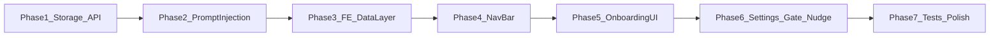

# Phased implementation plan (Personalized onboarding + navbar)

This splits [docs/artifacts/personalized-onboarding-plan.md](docs/artifacts/personalized-onboarding-plan.md) into **7 phases**. Implement in order; later phases depend on earlier ones.

**Product constants (unchanged from artifact):** Navbar **only on** [`HomePage`](frontend-react/src/pages/HomePage.tsx) (`/`). Onboarding is **2 steps** (literary DNA + mood), skippable. [`SessionSidebar`](frontend-react/src/components/layout/SessionSidebar.tsx) stays as-is for profile/sign-out on other routes.

---

## Phase 1 — Backend: user document + HTTP API

**Goal:** Persist `users/{uid}` in Firestore and expose authenticated CRUD so the frontend can load/save profile and preferences.

**Deliverables:**
- Pydantic models in [`emotional-chronicler/app/domain/user.py`](emotional-chronicler/app/domain/user.py) (`UserProfile`, `UserPreferences` with the fields from section 6.1 of the artifact).
- [`emotional-chronicler/app/core/user_store.py`](emotional-chronicler/app/core/user_store.py): get, upsert, `mark_onboarded` / skip semantics aligned with `POST .../onboarding/complete` and `.../skip`.
- [`emotional-chronicler/app/server/user_routes.py`](emotional-chronicler/app/server/user_routes.py): `GET/PUT /users/me`, `POST /users/me/onboarding/complete`, `POST /users/me/onboarding/skip` (router prefix only; app mounts at [`/api/v1`](emotional-chronicler/app/server/factory.py)).
- Register router in [`emotional-chronicler/app/server/factory.py`](emotional-chronicler/app/server/factory.py) like existing routers.

**Exit criteria:** Manual test with Bearer token: GET returns stub or doc; PUT persists; complete/skip set `onboardedAt`.

---

## Phase 2 — Backend: Reader Profile preamble + wiring

**Goal:** Every authenticated story and companion turn can see a compact "READER PROFILE" block built from Firestore.

**Deliverables:**
- [`emotional-chronicler/app/services/user_preferences_loader.py`](emotional-chronicler/app/services/user_preferences_loader.py): build preamble string; `applied=False` when empty.
- Story pipeline: after [`CompanionContextLoader`](emotional-chronicler/app/services/companion_context_loader.py), prepend user preamble then companion text (order as in artifact section 6.4). Touch the orchestration layer that already wraps the story route (e.g. [`routes.py`](emotional-chronicler/app/server/routes.py) / `StoryStreamOrchestrator` — follow existing project structure).
- Companion: inject preamble at start of companion chat in [`chat_routes.py`](emotional-chronicler/app/server/chat_routes.py) (first message or equivalent).

**Exit criteria:** With prefs saved for a test user, generated prompts include the preamble; anonymous/unauthenticated paths unchanged.

---

## Phase 3 — Frontend: types + API client + `useUserProfile`

**Goal:** Single source of truth for `/api/v1/users/me` and mutations.

**Deliverables:**
- [`frontend-react/src/types/user.ts`](frontend-react/src/types/user.ts) mirroring backend.
- [`frontend-react/src/hooks/useUserProfile.ts`](frontend-react/src/hooks/useUserProfile.ts) (React Query): query key e.g. `['me']`, mutations for PUT + onboarding complete/skip, invalidate on success.
- Reuse existing auth token pattern from session/story hooks (same `getIdToken` / base URL as [`useSessions`](frontend-react/src/hooks/useSessions.ts) or equivalent).

**Exit criteria:** DevTools / temporary UI can call hook and show loading/error/data; no UI polish required yet.

---

## Phase 4 — Frontend: HomePage profile button

**Goal:** A floating avatar button fixed to the top-right of the HomePage (`/`). Visible to every signed-in user regardless of preferences. Clicking opens a dropdown with Profile, Settings, and Sign Out.

**Deliverables:**
- [`ProfileButton.tsx`](frontend-react/src/components/layout/ProfileButton.tsx) — circular avatar button (uses `profile.photo_url` with initials fallback); click opens `ProfileMenu` dropdown.
- [`ProfileMenu.tsx`](frontend-react/src/components/layout/ProfileMenu.tsx) — dropdown panel (Profile · Settings · Sign Out); closes on click-outside or Escape.
- [`ProfileButton.module.css`](frontend-react/src/components/layout/ProfileButton.module.css) — positioned `absolute; top: 1.5rem; right: 1.5rem` inside the HomePage layout; no global bar, no wordmark.
- Mount **only** inside [`HomePage.tsx`](frontend-react/src/pages/HomePage.tsx). No changes to [`App.tsx`](frontend-react/src/App.tsx) or the global shell.
- No `OnboardingNudge` banner — the profile button is always present so users always have access to Settings.

**Exit criteria:** Signed-in user sees the avatar button on `/` only; clicking it opens the dropdown; `/companion` and `/story` pages unchanged; Settings can 404 or stub until Phase 6.

---

## Phase 5 — Frontend: onboarding wizard (2 steps)

**Goal:** `/onboarding` full-screen flow with Literary DNA + Mood steps, Back / Skip / Next / Save.

**Deliverables:**
- Routes in [`main.tsx`](frontend-react/src/main.tsx): `<Route path="onboarding" ... />`.
- [`OnboardingPage.tsx`](frontend-react/src/pages/OnboardingPage.tsx), [`OnboardingWizard.tsx`](frontend-react/src/components/onboarding/OnboardingWizard.tsx), steps `LiteraryDNAStep`, `MoodStep`, atoms `ChipSelect`, `TagInput`.
- Wire to `useUserProfile` mutations (complete vs skip).

**Exit criteria:** User can complete or skip; Firestore reflects preferences and `onboardedAt`.

---

## Phase 6 — Frontend: auth gate, Settings page

**Goal:** First-time flow wiring and editable preferences in Settings.

**Deliverables:**
- [`App.tsx`](frontend-react/src/App.tsx): after auth, if `onboardedAt` is null and path is not `/onboarding`, `navigate('/onboarding')`.
- [`SettingsPage.tsx`](frontend-react/src/pages/SettingsPage.tsx) + tabs (Profile / Story prefs / Account minimal); add route in `main.tsx`.
- `ProfileButton` / `ProfileMenu` links wire to `/settings` (and profile tab as needed).

**Exit criteria:** New user lands on onboarding after sign-in; skip lands back on HomePage; Settings saves and personalizes stories (via Phase 2 wiring).

---

## Phase 7 — Tests, feature flag, cache, docs sync

**Goal:** Regression safety and operability.

**Deliverables:**
- Backend unit tests: store, preamble formatting, user routes validation.
- Optional integration test: story request includes preamble when prefs set.
- Frontend tests: hook + critical wizard/nav interactions; optional Playwright happy path.
- Env `ONBOARDING_ENABLED` (if not already) and optional 60s in-memory cache in loader (per artifact section 9).
- Update [docs/artifacts/personalized-onboarding-plan.md](docs/artifacts/personalized-onboarding-plan.md) frontmatter/todos if still referencing "5-step" / `SegmentedChoice` so the doc matches the 2-step design.

**Exit criteria:** CI green for chosen test scope; artifact consistent with implementation.

---

## Suggested cadence

| Phase | Rough focus | Parallelizable |
|-------|-------------|----------------|
| 1 | Backend only | Yes (solo) |
| 2 | Backend only | After 1 |
| 3 | Frontend data | After 1 (can stub API until 1 lands) |
| 4 | UI | After 3 for real data; can build static UI earlier |
| 5 | UI + routes | After 3–4 |
| 6 | Integration | After 5 |
| 7 | Hardening | After 6 |

Start with **Phase 1**, then **Phase 2** so personalization works before investing in onboarding UI; **Phases 4–5** can swap with 2 if you prefer UI-first, but you will need Phase 1 API for real saves.
