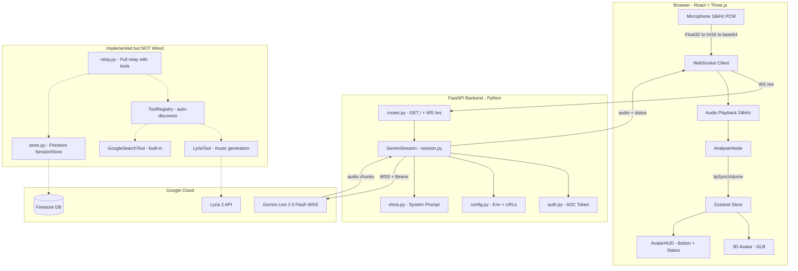
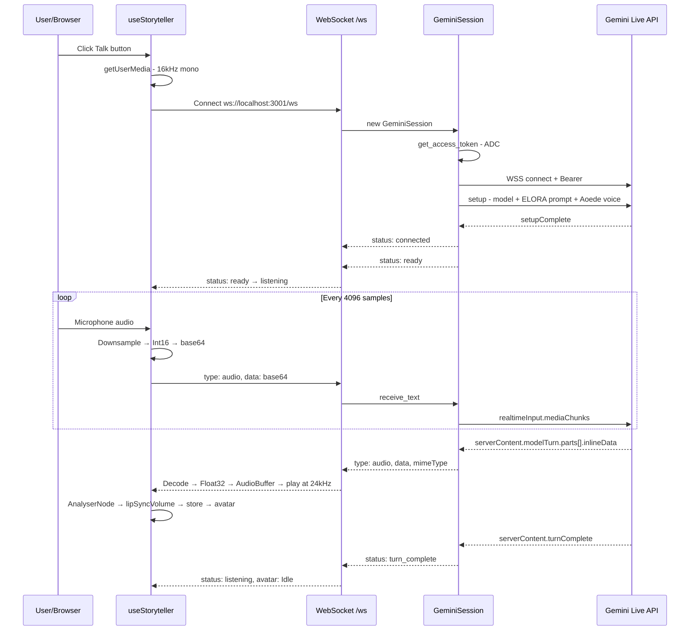
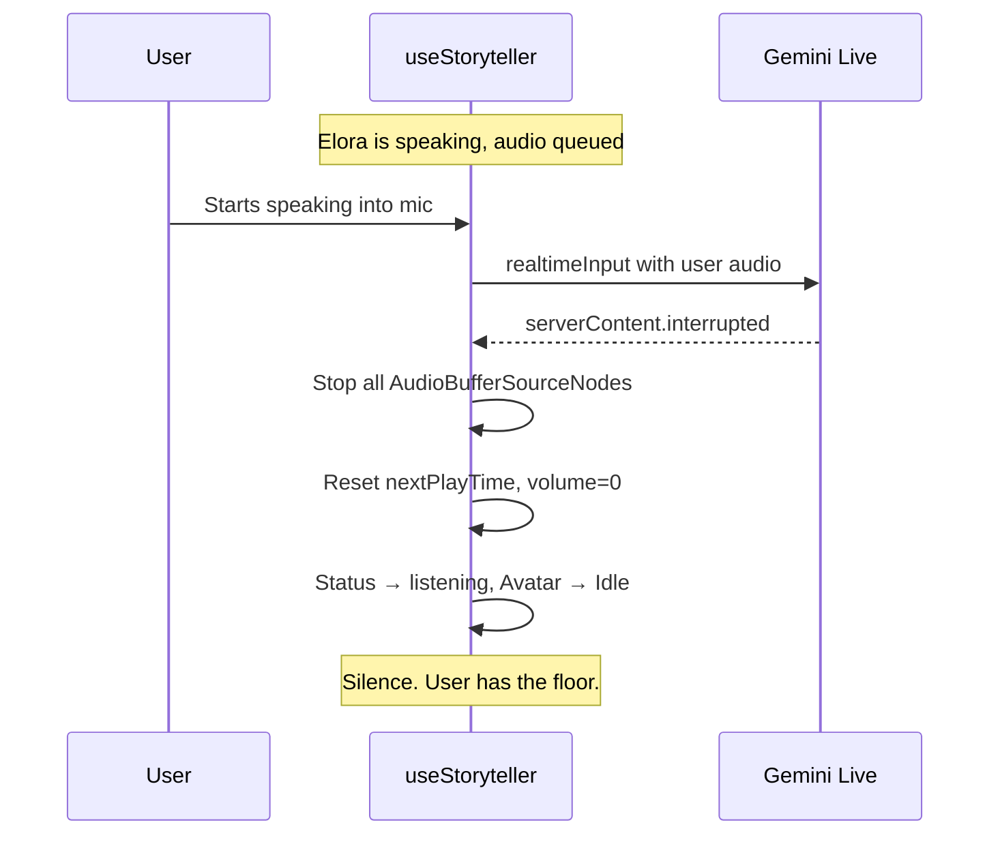

# 🔍 Deep Dive — The Emotional Chronicler

> Comprehensive analysis of every layer, data flow, and implementation detail.

---

## 1. What This Project Is

**The Emotional Chronicler** is a real-time, voice-driven AI storytelling application built for a Google Hackathon. A user speaks into their browser microphone, the audio is relayed through a FastAPI backend to the **Gemini Live 2.5 Flash** model via WebSocket, and Gemini's voice response streams back to the browser where a 3D avatar (Elora) lip-syncs to the audio.

The persona — **Elora** — is a warm, witty friend who is secretly a world-class novelist. She has two modes: casual conversation and immersive storytelling.

---

## 2. Architecture Overview



---

## 3. Backend — Layer by Layer

### 3.1 Entrypoint: [`main.py`](emotional-chronicler/main.py)

- Loads `.env` via `python-dotenv` **before** any app imports (critical for config)
- Configures stdlib logging to stdout with timestamped format
- Imports and exposes `app = create_app()` for uvicorn

### 3.2 Config: [`app/config.py`](emotional-chronicler/app/config.py)

| Symbol | Value | Purpose |
|--------|-------|---------|
| `BASE_DIR` | Parent of `app/` | Anchor for relative paths |
| `FRONTEND_DIR` | `../frontend-react/dist` | Static file mount for production |
| `PROJECT_ID` | From env `GOOGLE_CLOUD_PROJECT` | GCP project ID |
| `LOCATION` | From env, default `us-central1` | Vertex AI region |
| `GEMINI_LIVE_MODEL` | `gemini-live-2.5-flash-native-audio` | Model identifier |
| `PORT` | From env, default `3000` | Server port |
| [`get_gemini_ws_url()`](emotional-chronicler/app/config.py:31) | `wss://{LOCATION}-aiplatform.googleapis.com/ws/...BidiGenerateContent` | Vertex AI WebSocket endpoint |
| [`get_model_resource_name()`](emotional-chronicler/app/config.py:38) | `projects/{id}/locations/{loc}/publishers/google/models/{model}` | Full model resource path |

### 3.3 Server Factory: [`app/server/factory.py`](emotional-chronicler/app/server/factory.py)

[`create_app()`](emotional-chronicler/app/server/factory.py:22) does:
1. **Validates** `PROJECT_ID` exists — exits with error if missing
2. **Lifespan** context manager logs a startup banner with project/location/model/port
3. Creates `FastAPI` instance with title
4. Calls [`setup_middleware(app)`](emotional-chronicler/app/server/middleware.py) — CORS with `allow_origins=["*"]`, all methods, all headers
5. Mounts `FRONTEND_DIR` at `/static` for serving built frontend assets
6. Includes the router from [`routes.py`](emotional-chronicler/app/server/routes.py)

### 3.4 Routes: [`app/server/routes.py`](emotional-chronicler/app/server/routes.py)

Only two endpoints:

| Endpoint | Handler | Purpose |
|----------|---------|---------|
| `GET /` | [`serve_index()`](emotional-chronicler/app/server/routes.py:21) | Serves `FRONTEND_DIR/index.html` |
| `WS /ws` | [`websocket_endpoint()`](emotional-chronicler/app/server/routes.py:26) | Accepts WS, creates `GeminiSession`, calls `session.start()` |

The WS handler is a thin shell — all logic is in [`GeminiSession`](emotional-chronicler/app/core/session.py:15).

### 3.5 Auth: [`app/core/auth.py`](emotional-chronicler/app/core/auth.py)

[`get_access_token()`](emotional-chronicler/app/core/auth.py:7) — Uses Google Application Default Credentials (ADC) with `cloud-platform` scope. Refreshes and returns the bearer token. Called once per session start.

### 3.6 The Active Core: [`app/core/session.py`](emotional-chronicler/app/core/session.py) — GeminiSession

This is **the only code that actually runs** for the real-time conversation. One `GeminiSession` instance per browser WebSocket connection.

#### Lifecycle — [`start()`](emotional-chronicler/app/core/session.py:28):

```
1. get_access_token()           → OAuth2 bearer token
2. _connect(token)              → WSS to Gemini Live API (16MB max message)
3. _send_setup()                → Model + system prompt + voice config
4. Wait for setupComplete       → Gemini confirms ready
5. Send status: connected       → Client knows server is linked
6. Send status: ready           → Client can start talking
7. asyncio.gather(              → Two concurrent relay tasks
     _relay_gemini_to_client,
     _relay_client_to_gemini
   )
8. On error → send error msg   → Then cleanup
9. _cleanup()                   → Close Gemini WS
```

#### Setup Message — [`_send_setup()`](emotional-chronicler/app/core/session.py:80):

```json
{
  "setup": {
    "model": "projects/.../models/gemini-live-2.5-flash-native-audio",
    "systemInstruction": { "parts": [{ "text": "ELORA_SYSTEM_PROMPT" }] },
    "generationConfig": {
      "responseModalities": ["AUDIO"],
      "speechConfig": {
        "voiceConfig": {
          "prebuiltVoiceConfig": { "voiceName": "Aoede" }
        }
      }
    }
  }
}
```

**Key observation:** No `tools` or `toolConfig` in setup. Gemini never sees tool declarations, so it can never invoke tools.

#### Client → Gemini Relay — [`_relay_client_to_gemini()`](emotional-chronicler/app/core/session.py:154):

- Reads JSON text from browser WS
- Only handles `type: "audio"` messages
- Wraps base64 PCM data in `realtimeInput.mediaChunks` with `audio/pcm;rate=16000`
- Silently ignores all other message types (including `image`)

#### Gemini → Client Relay — [`_relay_gemini_to_client()`](emotional-chronicler/app/core/session.py:109):

Parses Gemini responses and forwards:

| Gemini Field | Client Message | Meaning |
|-------------|----------------|---------|
| `serverContent.modelTurn.parts[].inlineData` | `{type: "audio", data, mimeType}` | Audio chunk from Gemini |
| `serverContent.turnComplete` | `{type: "status", status: "turn_complete"}` | Model finished speaking |
| `serverContent.interrupted` | `{type: "status", status: "interrupted"}` | User barged in |
| Connection closed | `{type: "status", status: "disconnected"}` | Gemini WS dropped |

**Not forwarded:** `toolCall`, `inputTranscript`, text parts — none of these are handled.

### 3.7 Dead Code: [`app/core/relay.py`](emotional-chronicler/app/core/relay.py)

A more complete relay implementation that **is never imported or called**. It handles:

- [`relay_gemini_to_client()`](emotional-chronicler/app/core/relay.py:23) — Takes `ToolRegistry` and `SessionStore` as params
  - `setupComplete` → sends `status: ready`
  - `toolCall` → dispatches via `ToolRegistry`, sends `toolResponse` back to Gemini, logs to Firestore
  - `inputTranscript` → logs user speech, sends `transcript` to client
  - `modelTurn.parts[].text` → logs Elora's text, sends `transcript` to client
  - `modelTurn.parts[].inlineData` → forwards audio
  - `turnComplete` → signals turn end
- [`relay_client_to_gemini()`](emotional-chronicler/app/core/relay.py:141) — Same as session.py's version

### 3.8 Dead Code: [`app/core/store.py`](emotional-chronicler/app/core/store.py)

[`SessionStore`](emotional-chronicler/app/core/store.py:32) — Firestore-backed conversation memory:

- **Lazy Firestore client** — gracefully degrades if Firestore unavailable
- **Data model:** `sessions/{user_id}/conversations/{session_id}` with `created_at`, `updated_at`, `status`, `interactions[]`
- [`create_session()`](emotional-chronicler/app/core/store.py:56) — Creates doc with UUID-based session_id
- [`log_interaction(role, text)`](emotional-chronicler/app/core/store.py:89) — Appends `{role, text, timestamp}` via `ArrayUnion`
- [`log_tool_call(name, args)`](emotional-chronicler/app/core/store.py:114) — Appends tool call records
- [`end_session()`](emotional-chronicler/app/core/store.py:134) — Marks status as "ended"
- [`get_previous_context()`](emotional-chronicler/app/core/store.py:150) — Loads last 20 interactions from most recent ended session, formats as narrative memory for Elora's prompt

**Never instantiated** — no `user_id` concept exists in the active path.

### 3.9 Tool System: [`app/tools/`](emotional-chronicler/app/tools/__init__.py)

#### [`ToolRegistry`](emotional-chronicler/app/tools/__init__.py:19)

- Auto-discovers all `BaseTool` subclasses in `app/tools/*.py` on instantiation
- [`get_declarations()`](emotional-chronicler/app/tools/__init__.py:52) → list of tool dicts for Gemini setup
- [`dispatch(name, **kwargs)`](emotional-chronicler/app/tools/__init__.py:56) → executes matching tool; skips built-ins
- A singleton `tool_registry` is created on import — tools are registered at startup

#### [`BaseTool`](emotional-chronicler/app/tools/base.py:6) ABC

Properties: `name`, `declaration`, `execute(**kwargs)`, `is_builtin` (default False)

#### [`LyriaTool`](emotional-chronicler/app/tools/lyria.py:26) — `generate_music`

- Calls Vertex AI Lyria 2 predict endpoint
- Takes `prompt` + optional `negative_prompt`
- Returns `{audio_content: base64_wav, mime_type, duration_seconds: 33, description}`
- Uses `urllib.request` (no extra HTTP dependency)
- **Never invoked** — not in Gemini setup, no relay path to browser

#### [`GoogleSearchTool`](emotional-chronicler/app/tools/google_search.py:6) — built-in

- Declaration: `{"googleSearch": {}}`
- `is_builtin = True` — Gemini handles execution internally
- **Never included in setup**

### 3.10 System Prompt: [`app/prompts/elora.py`](emotional-chronicler/app/prompts/elora.py)

~239 lines defining Elora's persona. Key sections:

1. **Voice Rules** — Highest priority: stop instantly on barge-in, no formatting, natural speech only
2. **Identity** — Warm friend, secretly a Pulitzer/Booker/Hugo-winning novelist
3. **Mode 1: Conversation** — Short, casual, no unsolicited stories
4. **Mode 2: Storytelling** — Triggered when user asks for a story:
   - **Delivery:** Slow down, perform with voice, sensory immersion, use "you" for protagonist
   - **Hook:** Start in medias res, never "Once upon a time"
   - **Show don't tell:** Emotions through physical details
   - **Pacing:** Scene-level beats, tension/release cycles
   - **Genre rules:** Specific guidance per genre
   - **Flow:** No mid-story questions, keep going until natural end or user stops
5. **Greeting:** Always greet first, never reveal AI nature

---

## 4. Frontend — Layer by Layer

### 4.1 Stack

- React 19, Vite 7, TypeScript
- Three.js via `@react-three/fiber` + `@react-three/drei` + `@react-three/postprocessing`
- Zustand for state management

### 4.2 App Shell: [`App.tsx`](frontend-react/src/App.tsx)

- **3D Scene is commented out** (`<Scene />` disabled "for testing")
- Renders: header badge, connection status dot, `AvatarHUD`, dev emotion buttons
- Uses [`useStoryteller()`](frontend-react/src/hooks/useStoryteller.ts:7) for WS lifecycle
- Dev emotion controls: neutral/happy/sad/surprised buttons that set store state

### 4.3 State: [`useAvatarStore.ts`](frontend-react/src/store/useAvatarStore.ts)

Zustand store with three values:
- `currentAction`: `'Idle' | 'Speaking' | 'Listening'` — drives avatar animation
- `currentEmotion`: `'neutral' | 'happy' | 'sad' | 'surprised'` — drives morph targets
- `lipSyncVolume`: `number` (0–1) — drives mouth movement

### 4.4 Core Hook: [`useStoryteller.ts`](frontend-react/src/hooks/useStoryteller.ts)

This is the **heart of the frontend**. Manages the entire audio pipeline and WebSocket lifecycle.

#### State Machine:

```
disconnected → connecting → connected → listening ⇄ speaking → disconnected
                                                              → error
```

#### [`startStory()`](frontend-react/src/hooks/useStoryteller.ts:69) Flow:

1. Request microphone (`getUserMedia` with echo cancellation + noise suppression)
2. Create `AudioContext` for capture
3. Create `ScriptProcessorNode` (4096 buffer, mono) — **deprecated API**
4. On each audio process event:
   - Downsample from native rate to 16kHz (linear interpolation)
   - Convert Float32 → Int16 PCM
   - Encode to base64
   - Send `{type: "audio", data}` over WS
5. Connect to `ws://localhost:3001/ws` — **hardcoded URL**
6. Create playback `AudioContext` at 24kHz
7. Create `AnalyserNode` (FFT 512) for lip-sync volume
8. Start `requestAnimationFrame` loop reading frequency data → `setLipSyncVolume()`

#### WS Message Handling:

| Message Type | Action |
|-------------|--------|
| `status: connected` | Set status `connected` |
| `status: ready` | Set status `listening`, avatar `Idle` |
| `status: turn_complete` | Set status `listening`, avatar `Idle` |
| `status: interrupted` | Stop all queued audio sources, reset playback time, avatar `Idle`, volume 0 |
| `audio` | Set status `speaking`, avatar `Talking`, decode base64 → Int16 → Float32, create `AudioBufferSource`, schedule gapless playback via `nextPlayTimeRef` |
| `tool_event` | Log only (backend never sends this) |
| `error` | Log + set status `error` |

#### Barge-in Handling:

When `interrupted` arrives, all active `AudioBufferSourceNode`s are stopped immediately and the playback queue is reset. This provides instant silence when the user starts speaking.

#### [`sendImage()`](frontend-react/src/hooks/useStoryteller.ts:278):

Reads a `File` as data URL, extracts MIME type and base64 data, sends `{type: "image", mimeType, data}`. **Backend ignores this message type.**

#### [`cleanup()`](frontend-react/src/hooks/useStoryteller.ts:29):

Stops media tracks, disconnects audio nodes, closes both AudioContexts, cancels animation frame, resets all refs and status.

### 4.5 3D Scene: [`Scene.tsx`](frontend-react/src/components/Scene.tsx)

**Currently disabled in App.tsx.** When enabled:
- Three.js Canvas with shadows, 55° FOV camera
- Cinematic lighting: purple ambient, cool-white directional key, purple rim, teal fill, indigo ground bounce
- `Avatar` component at y=-0.9
- City environment map for reflections
- Purple + teal `Sparkles` particles for magical atmosphere
- `ContactShadows` on ground plane
- `OrbitControls` — pan/zoom disabled, limited polar angle
- `PostFX` — bloom + vignette post-processing

### 4.6 Avatar: [`Avatar.tsx`](frontend-react/src/components/Avatar.tsx)

- Loads `.glb` from GCS: `https://storage.googleapis.com/storyteller-avatars/69a498bf2b9bcc76d542b064.glb`
- **Entrance animation:** Slides in from x=-7 over 1.8s with easeOutCubic
- **Wave phase:** After entrance, plays a wave gesture
- **Bone tracking:** Spine, head, arms, forearms — for procedural animation
- **Morph targets:** Face mesh + teeth mesh for expressions and lip-sync
- **Blink system:** Random 2–5s interval blink cycle
- **Emotion morphs:** Maps `currentEmotion` to morph target weights
- **Lip-sync:** Maps `lipSyncVolume` from store to jaw/mouth morph targets
- **Head tracking:** Subtle procedural head movement
- **Breathing:** Subtle spine oscillation

### 4.7 AvatarHUD: [`AvatarHUD.tsx`](frontend-react/src/components/AvatarHUD.tsx)

- Status-aware talk button with color-coded states
- Animated waveform bars when speaking
- Status label text per state
- Start/stop toggle based on connection status

---

## 5. Complete Data Flow

### 5.1 Happy Path — User Speaks, Elora Responds



### 5.2 Barge-in Flow



---

## 6. What Is NOT Connected — Gap Analysis

| Component | Status | What It Does | What Is Missing |
|-----------|--------|-------------|-----------------|
| [`relay.py`](emotional-chronicler/app/core/relay.py) | Dead code | Full relay with tool dispatch, transcripts, Firestore logging | Not imported by routes or session; session.py has its own inline relay |
| [`store.py`](emotional-chronicler/app/core/store.py) | Dead code | Firestore session persistence + memory retrieval | No user_id concept, never instantiated |
| [`ToolRegistry`](emotional-chronicler/app/tools/__init__.py:19) | Instantiated but unused | Auto-discovers LyriaTool + GoogleSearchTool | session.py setup message has no `tools` field |
| [`LyriaTool`](emotional-chronicler/app/tools/lyria.py:26) | Registered but unreachable | Generates music via Lyria 2 API | No tool declarations in setup, no relay path for music audio to browser |
| [`GoogleSearchTool`](emotional-chronicler/app/tools/google_search.py:6) | Registered but unreachable | Built-in Gemini grounding | Not in setup message |
| [`sendImage()`](frontend-react/src/hooks/useStoryteller.ts:278) | Frontend only | Sends image over WS | Backend only handles `type: "audio"`, ignores `type: "image"` |
| Transcripts | Not sent | relay.py would send `inputTranscript` + model text | session.py does not extract or forward text |
| `<Scene />` | Commented out | Full 3D scene with avatar, lighting, particles | Disabled in App.tsx "for testing" |
| WS URL | Hardcoded | `ws://localhost:3001/ws` | No env variable or production URL support |
| `ScriptProcessorNode` | Deprecated | Audio capture in useStoryteller | Should migrate to AudioWorklet |

---

## 7. Technology Inventory

### Backend Dependencies

| Package | Version | Used? |
|---------|---------|-------|
| fastapi | ≥0.115.0 | ✅ Active |
| uvicorn | ≥0.32.0 | ✅ Active |
| websockets | ≥15.0 | ✅ Active (Gemini WSS) |
| google-auth | ≥2.38.0 | ✅ Active (ADC) |
| python-dotenv | ≥1.1.0 | ✅ Active |
| google-cloud-firestore | ≥2.19.0 | ❌ Dead code |
| google-adk | ≥1.1.1 | ❌ Not used (raw WS instead) |

### Frontend Dependencies

| Package | Purpose |
|---------|---------|
| react 19 | UI framework |
| three.js | 3D rendering |
| @react-three/fiber | React Three.js renderer |
| @react-three/drei | Three.js helpers (GLTF, env, controls) |
| @react-three/postprocessing | Bloom, vignette |
| zustand | State management |
| vite 7 | Build tool |
| typescript | Type safety |

---

## 8. Key Design Decisions & Observations

1. **Audio-only pipeline:** The setup explicitly requests `responseModalities: ["AUDIO"]` — Gemini returns only audio, no text. This means transcripts are impossible without changing the setup config.

2. **No tools in setup:** Even though `ToolRegistry` discovers and registers tools at import time, [`_send_setup()`](emotional-chronicler/app/core/session.py:80) never includes tool declarations. Gemini cannot call tools it does not know about.

3. **Two relay implementations:** [`session.py`](emotional-chronicler/app/core/session.py) has a minimal inline relay, while [`relay.py`](emotional-chronicler/app/core/relay.py) has a full-featured one. This is classic hackathon code — the simpler version works, the advanced one was aspirational.

4. **Gapless audio playback:** The frontend uses `nextPlayTimeRef` to schedule audio buffers back-to-back, preventing gaps between chunks. This is a well-implemented pattern.

5. **Barge-in is well-handled:** Both backend (Gemini's `interrupted` signal) and frontend (stopping all active sources) work together for clean interruption.

6. **3D Scene disabled:** The full Three.js scene with avatar, particles, and post-processing exists but is commented out in [`App.tsx`](frontend-react/src/App.tsx:16), likely for performance during development.

7. **Voice choice:** "Aoede" — one of Gemini's prebuilt voices, chosen for its warm, storytelling quality.

8. **Memory system designed but not connected:** [`get_previous_context()`](emotional-chronicler/app/core/store.py:150) formats past interactions as narrative memory for Elora — a thoughtful design for continuity across sessions.
