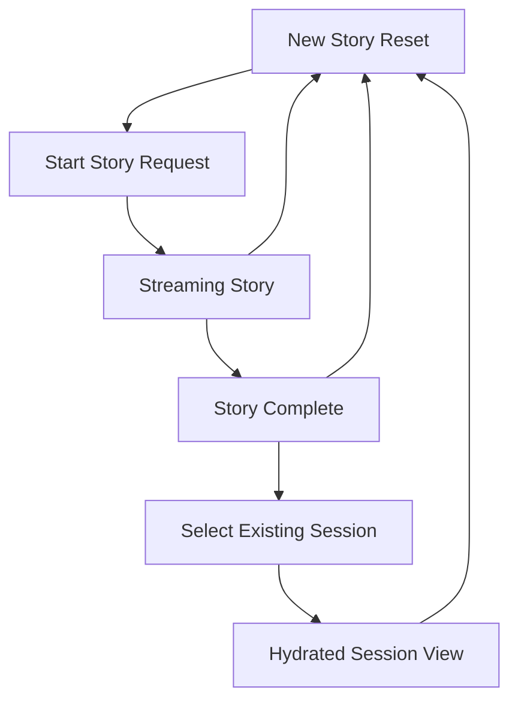

# Session and Chat Connectivity Fix Plan

## Objective
Repair the broken story-start flow and sidebar controls by aligning frontend API calls with the backend origin, replacing placeholder sidebar handlers with real state management, and connecting story generation with session persistence and session rehydration.

## Confirmed Problems

### 1. Story requests target the wrong origin in development
- [`useStoryteller()`](../frontend-react/src/hooks/useStoryteller.ts:55) posts to [`fetch('/api/story')`](../frontend-react/src/hooks/useStoryteller.ts:77)
- [`useSessions()`](../frontend-react/src/hooks/useSessions.ts:5) correctly uses [`VITE_API_URL`](../frontend-react/src/hooks/useSessions.ts:5)
- [`vite.config.ts`](../frontend-react/vite.config.ts) has no proxy, so relative story requests do not reliably reach FastAPI in local development

### 2. Sidebar close and session click behavior are wired to no-ops
- [`SessionSidebar`](../frontend-react/src/components/SessionSidebar.tsx:71) expects functional callbacks
- [`App`](../frontend-react/src/App.tsx:78) passes `activeSessionId={null}`
- [`App`](../frontend-react/src/App.tsx:80) passes [`onSelectSession={() => {}}`](../frontend-react/src/App.tsx:80)
- [`App`](../frontend-react/src/App.tsx:87) passes `isOpen={true}`
- [`App`](../frontend-react/src/App.tsx:88) passes [`onToggle={() => {}}`](../frontend-react/src/App.tsx:88)

### 3. New Story only resets transient UI state
- [`handleNewStory()`](../frontend-react/src/App.tsx:50) only calls [`stopStory()`](../frontend-react/src/hooks/useStoryteller.ts:165)
- It does not clear selected session state, create a draft session, or establish a visible navigation effect when the app is already idle

### 4. Story generation is not properly tied to persisted session lifecycle
- [`generate_story()`](../emotional-chronicler/app/server/routes.py:45) accepts optional `user_id` and `session_id`
- The frontend currently sends only `prompt` from [`useStoryteller()`](../frontend-react/src/hooks/useStoryteller.ts:83)
- Session listing exists in [`session_routes.py`](../emotional-chronicler/app/server/session_routes.py:19), but story creation does not reliably create or update those same persisted sessions for authenticated users

## Desired End State
- Clicking Begin Story always sends a request to the backend API origin
- Clicking the sidebar close icon actually opens and closes the sidebar
- Clicking New Story reliably resets the workspace into a fresh-composer state
- Clicking an existing session opens that session and rehydrates the story view
- Story creation and session listing reference the same authenticated session model
- Frontend and backend logs make failures observable

## Implementation Plan

### Phase 1: Stabilize the transport path
1. In [`useStoryteller()`](../frontend-react/src/hooks/useStoryteller.ts:55), introduce the same API base pattern already used in [`useSessions()`](../frontend-react/src/hooks/useSessions.ts:5)
2. Replace the relative story POST target with a backend-qualified URL
3. Add request lifecycle logging around token acquisition, request dispatch, response receipt, SSE event parsing, aborts, and failures
4. Decide whether to keep direct backend URLs or add a Vite proxy in [`vite.config.ts`](../frontend-react/vite.config.ts:1)
5. Prefer one canonical approach across all frontend API consumers to prevent split-brain networking behavior

### Phase 2: Replace placeholder sidebar wiring in the app shell
1. Add explicit local state in [`App`](../frontend-react/src/App.tsx:43) for:
   - sidebar open or closed
   - active session id
   - selected session detail or hydrated story content
2. Pass real values to [`SessionSidebar`](../frontend-react/src/components/SessionSidebar.tsx:67)
3. Replace the current no-op toggle with a stateful handler
4. Replace the current no-op session select with a real selection handler
5. Ensure the selected session is visually highlighted through [`activeSessionId`](../frontend-react/src/components/SessionSidebar.tsx:70)

### Phase 3: Define the source of truth for story state
1. Decide whether the source of truth is:
   - transient SSE sections in the client
   - persisted interactions from the backend
   - or a hybrid of both
2. Recommended approach:
   - use client state for live streaming in-progress content
   - use persisted session detail as the source of truth when reopening an existing story
3. Add a transformer that converts persisted interactions into the structure expected by [`StoryView`](../frontend-react/src/components/StoryView.tsx)
4. Make sure switching sessions clears any in-flight generation and audio state before hydrating the selected session

### Phase 4: Make New Story behavior explicit and predictable
1. Define New Story semantics clearly:
   - reset composer
   - clear current session selection
   - stop in-flight requests
   - stop audio playback
   - show prompt input immediately
2. Do not silently rely on [`stopStory()`](../frontend-react/src/hooks/useStoryteller.ts:165) alone
3. If product expectations require immediate persistence, add a backend draft-session creation endpoint
4. If not, keep New Story purely client-side until the first prompt is submitted

### Phase 5: Align backend story generation with authenticated sessions
1. Update [`generate_story()`](../emotional-chronicler/app/server/routes.py:45) to derive the authenticated user when an Authorization header is present
2. Decide whether story generation should require authentication or allow optional anonymous sessions
3. Recommended approach:
   - authenticated users use Firebase `uid`
   - anonymous mode is either disallowed or intentionally isolated
4. Ensure a session is created or resumed in the same persistence layer used by [`SessionStore`](../emotional-chronicler/app/core/store.py:51)
5. Ensure each story request can:
   - create a new session when no `session_id` is provided
   - continue an existing session when `session_id` is provided
6. Return the resolved `session_id` early in the stream or in a companion endpoint so the frontend can track it reliably

### Phase 6: Load and hydrate session detail on selection
1. Add a frontend path for [`GET /api/sessions/{session_id}`](../emotional-chronicler/app/server/session_routes.py:27)
2. Store the returned payload using the existing [`SessionDetail`](../frontend-react/src/types/session.ts:11) type
3. Map interactions into view sections for [`StoryView`](../frontend-react/src/components/StoryView.tsx)
4. Handle incomplete historical data gracefully, especially sessions that contain only text logs and no image or music metadata
5. If current persistence does not contain enough data to reconstruct images or music, document that limitation and decide whether schema evolution is required

### Phase 7: Add observability before and after the fix
1. Frontend logs in [`App`](../frontend-react/src/App.tsx:43) and [`useStoryteller()`](../frontend-react/src/hooks/useStoryteller.ts:55)
2. Frontend logs in [`useSessions()`](../frontend-react/src/hooks/useSessions.ts:13) for fetch, delete, rename, and select flows
3. Backend logs in [`generate_story()`](../emotional-chronicler/app/server/routes.py:45) for:
   - request receipt
   - resolved user id
   - resolved session id
   - session creation or resume decision
   - stream completion or failure
4. Backend logs in [`session_routes.py`](../emotional-chronicler/app/server/session_routes.py:19) for list and get flows when useful
5. Use structured log messages so frontend and backend traces can be correlated by session id

### Phase 8: Protect the fix with tests
1. Update frontend tests around [`App`](../frontend-react/src/App.tsx:43) and [`useStoryteller()`](../frontend-react/src/hooks/useStoryteller.ts:55)
2. Add tests that verify story requests use the configured API base
3. Add tests that verify sidebar toggle changes visible state
4. Add tests that verify session click invokes a real select flow
5. Add tests that verify New Story clears active session selection and returns to composer state
6. Add backend tests for authenticated story session creation and resume behavior in [`test_routes.py`](../emotional-chronicler/tests/test_routes.py) and [`test_session_routes.py`](../emotional-chronicler/tests/test_session_routes.py)

## Decision Points To Lock Before Coding
1. Should story generation be mandatory-auth or optional-auth
2. Should New Story create a persisted draft immediately or only after first prompt submission
3. Should historical sessions rehydrate full multimedia sections or text-only narrative until schema support is expanded
4. Should frontend API access standardize on direct backend URLs or Vite proxying in development

## Recommended Decisions
- Require authenticated session-backed story generation for signed-in users
- Keep New Story as a client reset until first prompt submission
- Rehydrate text immediately and add multimedia hydration only if stored metadata exists
- Standardize on one API base constant for all HTTP calls rather than mixing relative and absolute paths

## Execution Checklist
- [ ] Unify story API target with backend base URL
- [ ] Add temporary diagnostic logs on frontend story and sidebar flows
- [ ] Add sidebar open state and active session state in [`App`](../frontend-react/src/App.tsx:43)
- [ ] Implement session selection fetch and hydration
- [ ] Define and implement New Story reset semantics
- [ ] Align backend story route with authenticated session persistence
- [ ] Return or expose resolved session id to the frontend
- [ ] Add regression tests for transport, sidebar, and session rehydration
- [ ] Remove or reduce temporary debug logs after verification

## Risk Notes
- Existing stored session records may not contain enough metadata to perfectly reconstruct prior image or music sections
- Introducing session hydration without clear source-of-truth boundaries can create duplicated or stale content in the UI
- Mixing idle, generating, done, and hydrated states inside [`App`](../frontend-react/src/App.tsx:43) will become hard to reason about unless state transitions are explicitly modeled

## Recommended State Model

## What Should Be Implemented First
1. Transport fix in [`useStoryteller()`](../frontend-react/src/hooks/useStoryteller.ts:55)
2. Sidebar state fix in [`App`](../frontend-react/src/App.tsx:43)
3. Session selection and hydration path
4. Backend session alignment for story generation
5. Regression tests and cleanup
