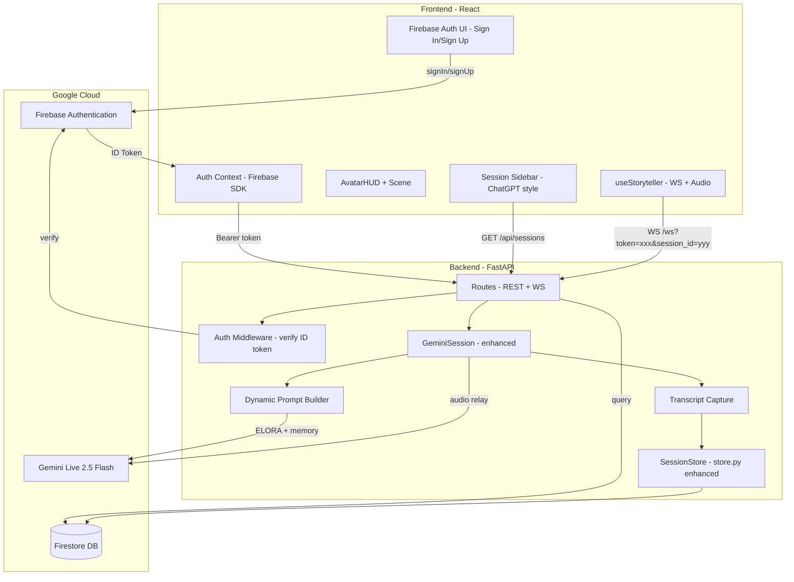
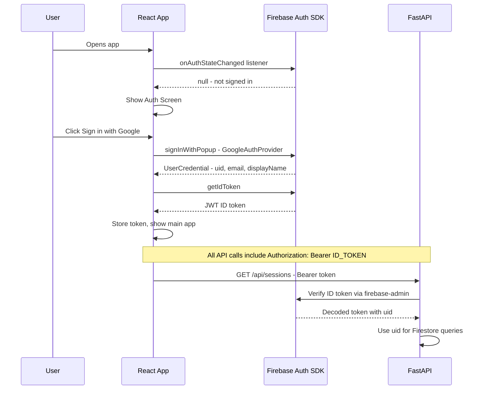
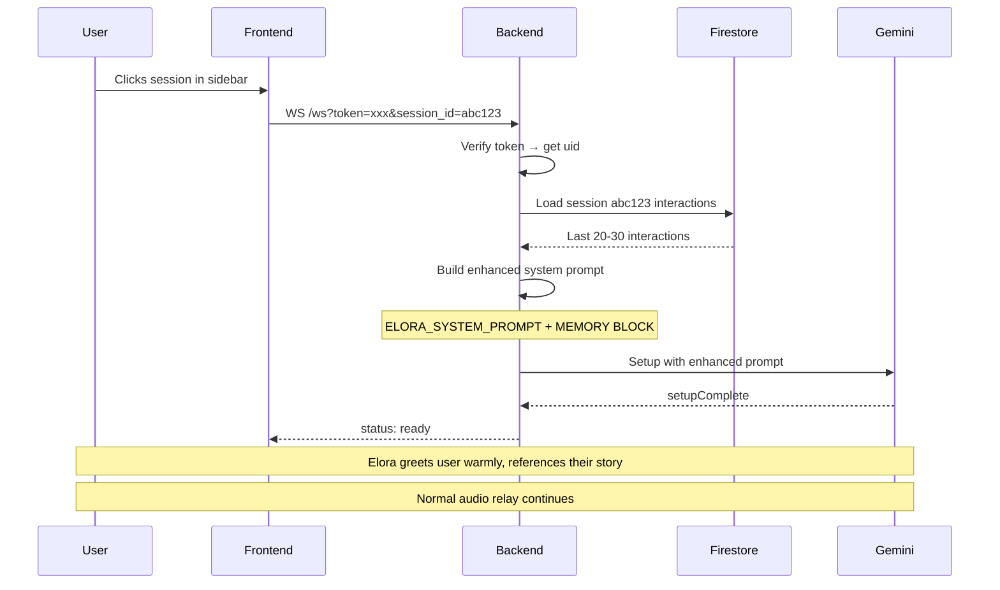

# 🏗️ Session Persistence & Auth — Architecture Plan

> Enable users to sign in, see their past story sessions (like ChatGPT), and resume any story where they left off.

---

## 1. The Core Challenge

**Gemini Live API sessions are ephemeral.** When the WebSocket closes, the conversation context is gone forever. There is no "resume session" API.

**Solution:** Capture transcripts during the live session, store them in Firestore, and when the user reconnects to continue a story, inject the previous conversation as narrative context into Elora's system prompt. Elora "remembers" by reading what happened before.

---

## 2. High-Level Architecture



---

## 3. Firebase Authentication

### 3.1 What Firebase Auth Provides

- **Google Sign-In** — one-click, no password needed
- **Email/Password** — traditional sign-up/sign-in
- **ID Tokens** — JWT tokens that the backend can verify
- **User UIDs** — stable unique identifiers for Firestore documents

### 3.2 Frontend Auth Flow



### 3.3 Frontend Implementation

**New dependencies:**
```
npm install firebase
```

**New files:**
- `src/config/firebase.ts` — Firebase app initialization
- `src/contexts/AuthContext.tsx` — React context providing user state + sign-in/sign-out methods
- `src/components/AuthScreen.tsx` — Sign-in/sign-up UI (Google button + email/password form)
- `src/components/SessionSidebar.tsx` — List of past sessions

**Auth flow in App.tsx:**
```
if not authenticated → show AuthScreen
if authenticated → show main app with SessionSidebar + AvatarHUD
```

### 3.4 Backend Auth

**New dependency:**
```
firebase-admin
```

**New files:**
- `app/core/firebase.py` — Initialize Firebase Admin SDK, `verify_id_token(token)` function
- `app/server/auth_middleware.py` — Extract Bearer token from request, verify, attach `user_id` to request state

**WebSocket auth:** The WS endpoint at `/ws` will accept the Firebase ID token as a query parameter (`/ws?token=xxx`) since WebSocket headers are limited in browsers. The token is verified before the session starts.

---

## 4. Transcript Capture

### 4.1 The Problem

Currently, [`_send_setup()`](emotional-chronicler/app/core/session.py:80) requests `responseModalities: ["AUDIO"]` only. Gemini returns audio chunks but **no text**. We need text to store conversations.

### 4.2 The Solution

Change the setup to request **both AUDIO and TEXT** response modalities:

```python
"generationConfig": {
    "responseModalities": ["AUDIO", "TEXT"],
    ...
}
```

With this change, Gemini will send:
- `serverContent.modelTurn.parts[].inlineData` — audio (as before)
- `serverContent.modelTurn.parts[].text` — Elora's narration text
- `serverContent.inputTranscript` — user's speech transcribed to text

### 4.3 Enhanced Relay

The existing [`relay.py`](emotional-chronicler/app/core/relay.py) already handles all of this! It processes:
- `inputTranscript` → logs to Firestore + sends to client
- `modelTurn.parts[].text` → logs to Firestore + sends to client
- `modelTurn.parts[].inlineData` → forwards audio to client

**Plan:** Replace the inline relay in [`session.py`](emotional-chronicler/app/core/session.py) with the functions from [`relay.py`](emotional-chronicler/app/core/relay.py), passing in the `SessionStore` and `ToolRegistry`.

---

## 5. Firestore Data Model

### 5.1 Collection Structure

```
users/{uid}/
    profile: { displayName, email, createdAt }

sessions/{uid}/conversations/{session_id}/
    title: "The Haunted Lighthouse"          # Auto-generated from first story prompt
    status: "active" | "ended"
    created_at: timestamp
    updated_at: timestamp
    interactions: [
        { role: "user", text: "Tell me a scary story", timestamp: "..." },
        { role: "elora", text: "The lighthouse keeper hadn't...", timestamp: "..." },
        { role: "tool", name: "generate_music", args: {...}, timestamp: "..." }
    ]
    summary: "A horror story about a haunted lighthouse..."  # Optional: AI-generated summary
```

This matches the existing [`SessionStore`](emotional-chronicler/app/core/store.py:32) design almost exactly. Changes needed:
- Add `title` field (auto-generated from first user message or story theme)
- The existing [`create_session()`](emotional-chronicler/app/core/store.py:56), [`log_interaction()`](emotional-chronicler/app/core/store.py:89), [`end_session()`](emotional-chronicler/app/core/store.py:134), and [`get_previous_context()`](emotional-chronicler/app/core/store.py:150) methods are already well-designed

### 5.2 Session Title Generation

When the first story-related interaction happens, use a simple heuristic or a quick Gemini text call to generate a short title (e.g., "The Haunted Lighthouse", "Space Pirates Adventure").

---

## 6. Session Resume Flow

### 6.1 How It Works

When a user selects a previous session to continue:



### 6.2 Dynamic Prompt Construction

The existing [`get_previous_context()`](emotional-chronicler/app/core/store.py:150) already formats past interactions as narrative memory. The enhanced session setup will:

1. Start with `ELORA_SYSTEM_PROMPT` (the full 239-line prompt)
2. Append the memory block from `get_previous_context()`
3. Send the combined prompt as `systemInstruction`

Example memory block (already coded in store.py):
```
═══════════════════════════════════════════════════════════════
MEMORY — YOUR PREVIOUS SESSION WITH THIS TRAVELER
═══════════════════════════════════════════════════════════════

This traveler has visited your hearth before. Here is what happened
in your last encounter:

The traveler said: "Tell me a scary story about a lighthouse"
You (ELORA) narrated: "The lighthouse keeper hadn't slept in three days..."
The traveler said: "What happened to the keeper?"
You (ELORA) narrated: "His hands were shaking as he climbed the spiral stairs..."

Use this memory naturally. Welcome them back warmly. Reference
their previous story if they wish to continue, but don't force it —
they may want a fresh tale. Let them choose.
═══════════════════════════════════════════════════════════════
```

### 6.3 New Session vs. Resume

- **New Session:** User clicks "New Story" → WS connects without `session_id` → fresh `ELORA_SYSTEM_PROMPT` only → new Firestore document created
- **Resume Session:** User clicks a session in sidebar → WS connects with `session_id` → prompt includes memory → same Firestore document gets new interactions appended

---

## 7. REST API Endpoints

New endpoints needed alongside the existing WS:

| Method | Path | Auth | Purpose |
|--------|------|------|---------|
| `GET` | `/api/sessions` | Required | List all sessions for the authenticated user |
| `GET` | `/api/sessions/{session_id}` | Required | Get session details + interactions |
| `DELETE` | `/api/sessions/{session_id}` | Required | Delete a session |
| `PATCH` | `/api/sessions/{session_id}` | Required | Rename a session title |
| `WS` | `/ws?token=xxx&session_id=yyy` | Required | Start/resume a storytelling session |

---

## 8. Frontend UI — Session Sidebar

### 8.1 Layout

```
┌──────────────────────────────────────────────────────┐
│ ┌─────────────┐ ┌──────────────────────────────────┐ │
│ │  SESSIONS   │ │                                  │ │
│ │             │ │     3D Scene / Avatar / HUD       │ │
│ │ + New Story │ │                                  │ │
│ │             │ │                                  │ │
│ │ Today       │ │                                  │ │
│ │ ▸ Haunted   │ │                                  │ │
│ │   Lighthouse│ │                                  │ │
│ │ ▸ Space     │ │                                  │ │
│ │   Pirates   │ │                                  │ │
│ │             │ │                                  │ │
│ │ Yesterday   │ │                                  │ │
│ │ ▸ The Lost  │ │                                  │ │
│ │   Garden    │ │                                  │ │
│ │             │ │                                  │ │
│ │ ─────────── │ │                                  │ │
│ │ 👤 User     │ │                                  │ │
│ │ Sign Out    │ │                                  │ │
│ └─────────────┘ └──────────────────────────────────┘ │
└──────────────────────────────────────────────────────┘
```

### 8.2 Session Sidebar Features

- **New Story** button at top
- Sessions grouped by date (Today, Yesterday, Previous 7 Days, Older)
- Each session shows: title, brief preview of last interaction, timestamp
- Click to select → loads session and connects WS with `session_id`
- Right-click or menu: Rename, Delete
- Bottom: User avatar/name + Sign Out button
- Collapsible on mobile (hamburger menu)

### 8.3 New Frontend Files

| File | Purpose |
|------|---------|
| `src/config/firebase.ts` | Firebase app init with config |
| `src/contexts/AuthContext.tsx` | Auth state provider |
| `src/components/AuthScreen.tsx` | Sign-in / sign-up page |
| `src/components/SessionSidebar.tsx` | ChatGPT-style session list |
| `src/components/SessionItem.tsx` | Individual session row |
| `src/hooks/useSessions.ts` | Fetch/manage sessions via REST API |
| `src/types/session.ts` | TypeScript types for session data |

---

## 9. Backend Changes Summary

### 9.1 New Files

| File | Purpose |
|------|---------|
| `app/core/firebase.py` | Firebase Admin SDK init + `verify_id_token()` |
| `app/server/auth_middleware.py` | Extract + verify Bearer token on HTTP routes |
| `app/server/session_routes.py` | REST endpoints for `/api/sessions/*` |

### 9.2 Modified Files

| File | Changes |
|------|---------|
| [`session.py`](emotional-chronicler/app/core/session.py) | Accept `user_id` + `session_id`, use `relay.py` functions instead of inline relay, build dynamic prompt with memory |
| [`store.py`](emotional-chronicler/app/core/store.py) | Add `title` field, add `list_sessions(user_id)` method, add `update_title()` method |
| [`relay.py`](emotional-chronicler/app/core/relay.py) | Already complete — just needs to be wired in |
| [`routes.py`](emotional-chronicler/app/server/routes.py) | WS endpoint accepts `token` + `session_id` query params, verifies auth |
| [`factory.py`](emotional-chronicler/app/server/factory.py) | Include new session_routes router, init Firebase Admin |
| [`config.py`](emotional-chronicler/app/config.py) | Add Firebase config |
| [`requirements.txt`](emotional-chronicler/requirements.txt) | Add `firebase-admin` |
| `_send_setup()` in session.py | Add `"TEXT"` to `responseModalities` for transcript capture |

---

## 10. Implementation Plan — Ordered Steps

### Phase 1: Firebase Auth (Backend)
1. Add `firebase-admin` to `requirements.txt`
2. Create `app/core/firebase.py` — init Firebase Admin, `verify_id_token()` function
3. Create `app/server/auth_middleware.py` — token verification dependency for FastAPI
4. Update `app/server/routes.py` — WS endpoint accepts and verifies `token` query param

### Phase 2: Firebase Auth (Frontend)
5. Install `firebase` npm package
6. Create `src/config/firebase.ts` — Firebase app initialization
7. Create `src/contexts/AuthContext.tsx` — auth state provider with Google + email/password
8. Create `src/components/AuthScreen.tsx` — sign-in/sign-up UI
9. Update `src/App.tsx` — wrap in AuthProvider, gate on auth state

### Phase 3: Transcript Capture
10. Update `_send_setup()` in `session.py` — add `"TEXT"` to `responseModalities`
11. Wire `relay.py` into `session.py` — replace inline relay with the full relay functions
12. Pass `SessionStore` instance to relay functions

### Phase 4: Session Storage (Backend)
13. Enhance `store.py` — add `title`, `list_sessions()`, `update_title()`, `delete_session()`
14. Create `app/server/session_routes.py` — REST API for sessions CRUD
15. Update `factory.py` — include session routes router
16. Update `session.py` — accept `user_id` + `session_id`, create/resume SessionStore

### Phase 5: Session Resume
17. Update `session.py` — build dynamic prompt with `get_previous_context()` when `session_id` provided
18. Update `store.py` — enhance `get_previous_context()` to load more interactions for longer stories

### Phase 6: Session Sidebar (Frontend)
19. Create `src/types/session.ts` — TypeScript types
20. Create `src/hooks/useSessions.ts` — fetch sessions from REST API
21. Create `src/components/SessionSidebar.tsx` — ChatGPT-style sidebar
22. Create `src/components/SessionItem.tsx` — individual session row
23. Update `src/hooks/useStoryteller.ts` — accept `session_id`, pass token in WS URL
24. Update `src/App.tsx` — integrate sidebar layout, session selection flow

### Phase 7: Polish
25. Auto-generate session titles from first story interaction
26. Handle edge cases: token refresh, session not found, Firestore errors
27. Update WS URL to use environment variable instead of hardcoded localhost
28. Re-enable the 3D Scene component

---

## 11. Firebase Project Setup Required

Before implementation, you need to:

1. **Enable Firebase** in your GCP project (`gemini-liveagent-488913`)
2. **Enable Authentication** in Firebase Console → Authentication → Sign-in method → Enable Google + Email/Password
3. **Get Firebase web config** (apiKey, authDomain, projectId, etc.) from Firebase Console → Project Settings → Your apps → Web app
4. **Firestore** is already in your GCP project — just ensure rules allow authenticated reads/writes

---

## 12. Security Considerations

| Area | Approach |
|------|----------|
| WS Authentication | ID token verified before Gemini session starts; invalid token → WS closed immediately |
| REST Authentication | Bearer token in Authorization header, verified via Firebase Admin SDK |
| Firestore Rules | Backend uses Admin SDK (bypasses rules), but set rules to deny direct client access |
| Token Refresh | Frontend refreshes ID token every ~55 min (Firebase tokens expire in 1 hour) |
| CORS | Tighten from `*` to specific origins in production |
| Session Ownership | All queries scoped to authenticated user's UID — users cannot access others' sessions |
