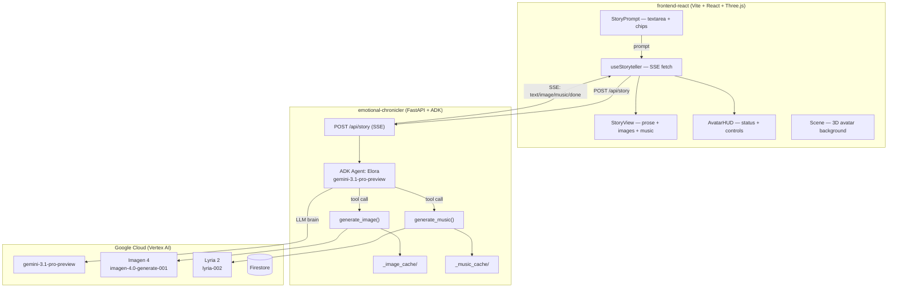

# 📘 Repository Info — The Emotional Chronicler
### Last updated: 2026-03-15 | Hackathon: Google Gemini Live Agent Challenge (deadline: 2026-03-16 17:00 PDT)
### Category: **Creative Storyteller** (interleaved multimodal output)

---

## ✅ What Has Been Built (Current State)

The project has been **fully migrated from the old Gemini Live API voice architecture to a new ADK-based illustrated story generation system**. The migration is complete in code. The app has NOT yet been tested end-to-end — that is the immediate next step.

### Architecture Summary

```
User (browser)
    │ types story prompt
    ▼
POST /api/story  (FastAPI)
    │
    ▼
Google ADK Runner
    └── Agent: Elora (gemini-3.1-pro-preview)
            │ writes literary prose
            │
            ├── tool: generate_image(scene_description)
            │       └── Imagen 4 (imagen-4.0-generate-001)
            │           → saves PNG to _image_cache/
            │           → returns { image_url: "/api/images/xxx.png" }
            │
            └── tool: generate_music(prompt)
                    └── Lyria 2 (lyria-002) via Vertex AI REST
                        → saves WAV to _music_cache/
                        → returns { audio_url: "/api/music/xxx.wav" }
    │
    ▼ SSE stream
Browser parses events:
    {"type": "text",  "chunk": "...prose..."}
    {"type": "image", "url": "/api/images/xxx.png", "caption": "..."}
    {"type": "music", "url": "/api/music/xxx.wav", "duration": 33}
    {"type": "done"}
    │
    ▼
StoryView.tsx renders:
    - Serif prose paragraphs (streaming, auto-scroll)
    - Imagen 4 illustrations (full-width with caption)
    - Lyria 2 music badge + <audio> player (auto-plays at 35% volume)
```

---

## 📁 Current Directory Structure

```
gemini-storyteller/
├── repo_info.md                        ← this file
├── emotional-chronicler/               # Python backend (FastAPI + ADK)
│   ├── main.py                         # Entrypoint: uvicorn main:app --port 3001
│   ├── requirements.txt                # includes google-adk>=0.4.0
│   ├── .env                            # GOOGLE_CLOUD_PROJECT, LOCATION, PORT
│   ├── _image_cache/                   # Imagen 4 generated PNGs (auto-created)
│   ├── _music_cache/                   # Lyria 2 generated WAVs (auto-created)
│   └── app/
│       ├── config.py                   # env vars, GenAI client, cache dirs, model names
│       ├── core/
│       │   ├── agent.py                # ✅ NEW — ADK Agent + Runner definition
│       │   ├── firebase.py             # Firebase admin init
│       │   ├── store.py                # Firestore session CRUD (still present, used by session_routes)
│       │   └── auth.py                 # Google ADC placeholder
│       ├── server/
│       │   ├── factory.py              # FastAPI app factory, startup banner
│       │   ├── middleware.py           # CORS (allow all origins — tighten for prod)
│       │   ├── routes.py               # ✅ REWRITTEN — POST /api/story, GET /api/images, GET /api/music, GET /
│       │   ├── session_routes.py       # REST CRUD for Firestore sessions (/api/sessions)
│       │   └── auth_middleware.py      # Firebase token verification
│       ├── tools/
│       │   ├── imagen.py               # ✅ NEW — Imagen 4 ADK tool function
│       │   ├── lyria.py                # ✅ UPDATED — added standalone generate_music() ADK function
│       │   ├── base.py                 # BaseTool ABC (legacy, no longer used by ADK path)
│       │   ├── __init__.py             # ToolRegistry auto-discovery (legacy, not used by ADK)
│       │   └── google_search.py        # GoogleSearchTool (legacy, not wired)
│       └── prompts/
│           └── elora.py                # ✅ REWRITTEN — literary author prompt for text+image stories
│
├── frontend-react/                     # React 19 + Vite + TypeScript + Three.js
│   └── src/
│       ├── App.tsx                     # ✅ REWRITTEN — wires prompt → story → controls
│       ├── hooks/
│       │   ├── useStoryteller.ts       # ✅ REWRITTEN — SSE fetch, no WebSocket, no mic
│       │   └── useSessions.ts          # REST session list/delete/rename (unchanged)
│       ├── components/
│       │   ├── StoryView.tsx           # ✅ NEW — scrollable prose + images + music player
│       │   ├── StoryPrompt.tsx         # ✅ NEW — prompt textarea + genre chips + submit
│       │   ├── AvatarHUD.tsx           # ✅ REWRITTEN — generating/done status + stop/new controls
│       │   ├── Scene.tsx               # 3D canvas + lighting + sparkles (UNCHANGED)
│       │   ├── Avatar.tsx              # 3D character (UNCHANGED — still decorative bg)
│       │   ├── SessionSidebar.tsx      # Story history sidebar (UNCHANGED)
│       │   ├── AuthScreen.tsx          # Firebase Google sign-in (UNCHANGED)
│       │   └── PostFX.tsx              # Bloom + vignette (UNCHANGED)
│       ├── contexts/
│       │   └── AuthContext.tsx         # Firebase auth state (UNCHANGED)
│       ├── store/
│       │   └── useAvatarStore.ts       # Avatar state (UNCHANGED — avatar still animates idle)
│       └── config/
│           └── firebase.ts             # Firebase SDK init (UNCHANGED)
```

### ❌ Deleted Files
- `emotional-chronicler/app/core/session.py` — Live API GeminiSession (removed)
- `emotional-chronicler/app/core/relay.py` — Live API bidirectional relay (removed)

---

## 🔧 Key Files — Deep Dive

### `app/config.py`
```python
STORY_MODEL  = "gemini-3.1-pro-preview"    # ADK agent brain (override via env STORY_MODEL)
IMAGEN_MODEL = "imagen-4.0-generate-001"   # Imagen 4 (override via env IMAGEN_MODEL)
LYRIA_MODEL  = "lyria-002"                 # Lyria 2 (hardcoded)
IMAGE_CACHE_DIR = BASE_DIR / "_image_cache"
MUSIC_CACHE_DIR = BASE_DIR / "_music_cache"
genai_client = genai.Client(vertexai=True, project=PROJECT_ID, location=LOCATION)
```
Also sets these env vars at import time so ADK picks them up:
```python
os.environ["GOOGLE_GENAI_USE_VERTEXAI"] = "true"
os.environ["GOOGLE_CLOUD_PROJECT"]       = PROJECT_ID
os.environ["GOOGLE_CLOUD_LOCATION"]      = LOCATION
```

### `app/core/agent.py`
```python
from google.adk.agents import Agent
from google.adk.runners import Runner
from google.adk.sessions import InMemorySessionService

elora_agent = Agent(
    name="elora",
    model=STORY_MODEL,                        # gemini-3.1-pro-preview
    instruction=ELORA_SYSTEM_PROMPT,
    tools=[generate_image, generate_music],   # plain async functions
)
runner = Runner(agent=elora_agent, app_name="emotional_chronicler",
                session_service=InMemorySessionService())
```
⚠️ **InMemorySessionService** — sessions are lost on server restart. Swap for Firestore-backed service for production (see TODO below).

### `app/tools/imagen.py`
- Async function `generate_image(scene_description, style)` — ADK tool
- Calls `genai_client.models.generate_images(model=IMAGEN_MODEL, prompt=..., config=GenerateImagesConfig(aspect_ratio="16:9", number_of_images=1))`
- Saves PNG to `_image_cache/{uuid}.png`
- Returns `{"image_url": "/api/images/xxx.png", "caption": "..."}`

### `app/tools/lyria.py`
- Contains **two implementations**:
  1. `LyriaTool(BaseTool)` — old class-based tool (legacy, not used by ADK)
  2. `generate_music(prompt, negative_prompt)` — new standalone async function (ADK tool)
- Calls Lyria 2 via Vertex AI REST (`/publishers/google/models/lyria-002:predict`)
- Saves WAV to `_music_cache/{uuid}.wav`
- Returns `{"audio_url": "/api/music/xxx.wav", "duration_seconds": 33}`

### `app/server/routes.py`
```
GET  /                      → serve frontend index.html
POST /api/story             → ADK agent SSE stream
GET  /api/images/{filename} → serve Imagen 4 PNGs from _image_cache/
GET  /api/music/{filename}  → serve Lyria 2 WAVs from _music_cache/
```
SSE event format:
```json
{"type": "text",  "chunk": "prose text..."}
{"type": "image", "url": "/api/images/abc.png", "caption": "..."}
{"type": "music", "url": "/api/music/abc.wav",  "duration": 33}
{"type": "done"}
{"type": "error", "message": "..."}
```

### `app/prompts/elora.py`
Completely rewritten for illustrated storytelling. Key rules:
- Write like a published novelist (third person, named characters, literary prose)
- **NEVER ask the reader questions** (5x explicit prohibition)
- Call `generate_image` at key visual moments (every 3–4 paragraphs max)
- Call `generate_music` at major scene/mood transitions
- End with a weighty final line, then stop

### `frontend-react/src/hooks/useStoryteller.ts`
```typescript
useStoryteller({ getIdToken }) → {
  status: 'idle' | 'generating' | 'done' | 'error',
  sections: StorySection[],     // accumulated story blocks
  currentMusic: string | null,  // currently playing audio URL
  startStory(prompt: string),   // POST /api/story → parse SSE
  stopStory(),                  // abort fetch, pause audio
}

type StorySection =
  | { type: 'text';  content: string }
  | { type: 'image'; url: string; caption: string }
  | { type: 'music'; url: string; duration: number }
```
Text chunks are **merged into the last text section** — consecutive chunks produce flowing prose, not fragmented words.

### `frontend-react/src/components/StoryView.tsx`
- Fixed-position centered panel, 740px wide, 72vh max height, scrolls automatically
- Prose: Georgia serif, 17px, 1.85 line height, justified, 1.5em indent
- Images: full-width 16:9 with figcaption
- Music: badge with SVG music icon + native `<audio controls>` element
- Blinking cursor shown while `status === 'generating'`

### `frontend-react/src/components/StoryPrompt.tsx`
- Shown when `status === 'idle'` or `status === 'error'`
- Textarea + "Begin the Story" button (⌘Enter shortcut)
- 6 genre suggestion chips that fill the textarea on click
- Positioned at bottom center of screen

### `frontend-react/src/components/AvatarHUD.tsx`
- Hidden when `status === 'idle'`
- Shows status badge (pulsing orb + label) when generating/done/error
- **Stop** button (red) during `generating`
- **New Story** button (purple gradient) when `done` or `error`

---

## 🔑 Environment Variables

| Variable | Example | Required |
|---|---|---|
| `GOOGLE_CLOUD_PROJECT` | `gemini-liveagent-488913` | ✅ Yes |
| `GOOGLE_CLOUD_LOCATION` | `us-central1` | ✅ Yes (default: us-central1) |
| `FIREBASE_ENABLED` | `true` | ✅ Yes (set false to skip auth in dev) |
| `PORT` | `3001` | Default: 3000 |
| `STORY_MODEL` | `gemini-3.1-pro-preview` | Default as shown |
| `IMAGEN_MODEL` | `imagen-4.0-generate-001` | Default as shown |

---

## 🚀 How to Run

### Backend
```bash
cd emotional-chronicler
pip install -r requirements.txt    # installs google-adk, google-genai, fastapi, etc.
# Ensure gcloud auth application-default login has been run
uvicorn main:app --port 3001 --reload
```

### Frontend (dev)
```bash
cd frontend-react
npm install
npm run dev       # http://localhost:5173
# Vite proxies /api/* to localhost:3001 (check vite.config.ts)
```

### Frontend (production build — served by backend)
```bash
cd frontend-react
npm run build     # outputs to dist/
# Backend serves dist/ as static files at /
```

---

## ⚠️ KNOWN ISSUES / THINGS TO VERIFY IMMEDIATELY

These must be checked before the hackathon submission:

### 1. google-adk package API compatibility ⚠️ CRITICAL
The code in `agent.py` and `routes.py` uses:
```python
from google.adk.agents import Agent
from google.adk.runners import Runner
from google.adk.sessions import InMemorySessionService
from google.genai import types as genai_types
# runner.run_async(user_id, session_id, new_message=genai_types.Content(...))
# event.content.parts → part.text / part.function_response
```
**Risk:** `google-adk` is evolving rapidly. The exact import paths and API surface may differ from the installed version. Run `pip show google-adk` and check the version. If imports fail, check the ADK changelog and update `agent.py` and `routes.py` accordingly.

**Fallback if ADK fails:** Replace ADK with a direct `genai_client.models.generate_content()` call with `response_modalities=["TEXT"]`, and call `generate_image` / `generate_music` as regular tool calls using the GenAI SDK function calling API (`google.genai.types.FunctionDeclaration`). This avoids the ADK dependency entirely.

### 2. gemini-3.1-pro-preview model availability ⚠️
Verify that `gemini-3.1-pro-preview` is available in your GCP project and region. If not, try:
- `gemini-3.0-pro-preview`
- `gemini-2.5-pro-preview`
- `gemini-2.0-flash-exp` (definitely available, may produce lower quality prose)

### 3. Imagen 4 model ID ⚠️
Verify `imagen-4.0-generate-001` is the correct model ID. If it fails, try:
- `imagen-4.0-generate-preview-05-20`
- `imagegeneration@006`
Check: https://cloud.google.com/vertex-ai/generative-ai/docs/image/generate-images

### 4. ADK session service async API
`routes.py` calls:
```python
existing = await runner.session_service.get_session(...)
await runner.session_service.create_session(...)
```
Verify these methods are `async` in the installed ADK version. If they're synchronous, remove the `await`.

### 5. Vite proxy config
The frontend calls `fetch('/api/story', ...)`. In dev mode, Vite needs to proxy `/api` to the backend. Check `frontend-react/vite.config.ts` — it should have:
```typescript
server: {
  proxy: { '/api': 'http://localhost:3001' }
}
```
If missing, add it.

### 6. TypeScript errors in tests
The test files (`useStoryteller.test.ts`, `AvatarHUD.test.tsx`) test the OLD interface. They will fail. Either:
- Update the tests to match the new interfaces
- Or skip tests for now (`npm run build` does not require passing tests)

### 7. SessionSidebar `onSelectSession`
In `App.tsx`, `onSelectSession` is now a no-op `() => {}`. The sidebar still renders session history fetched from `/api/sessions` (Firestore). This is fine for display, but selecting a past session does nothing. Post-hackathon: wire session selection to reload the story from Firestore.

---

## 📋 REMAINING TODO (Priority Order for Hackathon)

### 🔴 P0 — Must do before submission

1. **Install and test google-adk**
   ```bash
   cd emotional-chronicler
   pip install google-adk
   python -c "from google.adk.agents import Agent; print('OK')"
   ```
   Fix any import errors in `agent.py` and `routes.py`.

2. **Test the full story generation pipeline**
   ```bash
   curl -X POST http://localhost:3001/api/story \
     -H "Content-Type: application/json" \
     -d '{"prompt": "A short magical fantasy story"}' \
     --no-buffer
   ```
   Verify SSE events come through: text chunks, then image URL, then music URL, then done.

3. **Verify Imagen 4 and Lyria 2 work**
   - Check `_image_cache/` for PNGs after a story run
   - Check `_music_cache/` for WAVs after a story run
   - If Imagen 4 fails, fall back to Imagen 3 (`imagegeneration@006`)
   - If Lyria fails, the story should still work (music is optional)

4. **Build and test frontend**
   ```bash
   cd frontend-react
   npm install
   npm run build
   ```
   Fix any TypeScript errors. The most likely errors are in test files — ignore tests, focus on build.

5. **End-to-end browser test**
   - Open `http://localhost:3001`
   - Sign in with Google
   - Type a story prompt
   - Verify text streams in, image appears, music plays

### 🟡 P1 — Important for a good demo

6. **Fix cursor animation in StoryView**
   In `App.tsx` there's a global `<style>` tag with the `blink` keyframe. But `StoryView.tsx` also references it inline. Make sure the CSS keyframe is globally available. Add to `App.css` or `index.css`:
   ```css
   @keyframes blink { 0%,100% { opacity:1; } 50% { opacity:0; } }
   @keyframes pulse-orb { 0%,100% { opacity:1; } 50% { opacity:0.4; } }
   ```

7. **`textarea` focus style** — add to `App.css` or inline:
   ```css
   textarea:focus { border-color: rgba(124,58,237,0.6) !important; }
   ```

8. **Genre suggestion chips hover style** — add to `App.css`:
   ```css
   button:hover { background: rgba(124,58,237,0.15) !important; color: #c4b5fd !important; }
   ```

9. **StoryView scrollbar styling** — Chrome doesn't honor `scrollbar-color`. Add webkit scrollbar styles in `index.css` or `App.css`:
   ```css
   ::-webkit-scrollbar { width: 6px; }
   ::-webkit-scrollbar-track { background: transparent; }
   ::-webkit-scrollbar-thumb { background: rgba(124,58,237,0.4); border-radius: 3px; }
   ```

10. **Stop/new story keyboard shortcut** — add Escape key handler in App.tsx to stop generation.

### 🟢 P2 — Nice to have / post-hackathon

11. **Replace InMemorySessionService with Firestore-backed session persistence**
    This makes stories survive server restarts and supports session resumption.
    The `SessionStore` in `store.py` already has Firestore CRUD. Wire it to the ADK session service.

12. **Session sidebar "select session" → load story**
    Currently a no-op. To implement: store the generated `sections[]` array in Firestore when a story completes. On session select, fetch and display the stored story.

13. **Cache cleanup**
    `_image_cache/` and `_music_cache/` grow forever. Add a background task or LRU-based cleanup (e.g. delete files older than 24h on startup).

14. **CORS hardening**
    `middleware.py` allows all origins. Lock down to your production domain before submission.

15. **Google Cloud Run deployment** (required for hackathon compliance)
    ```bash
    gcloud run deploy emotional-chronicler \
      --source . \
      --region us-central1 \
      --allow-unauthenticated
    ```
    The app must be deployed on GCP for the hackathon.

16. **Update `repo_info.md` with the Cloud Run URL** once deployed.

---

## 🏆 Hackathon Compliance Checklist

| Requirement | Status |
|---|---|
| Uses a Gemini model | ✅ gemini-3.1-pro-preview |
| Built with Google GenAI SDK or ADK | ✅ google-adk + google-genai |
| Uses Google Cloud service | ✅ Vertex AI (Imagen 4, Lyria 2), Firestore |
| Creative Storyteller category — interleaved output | ✅ Text + Imagen 4 images + Lyria 2 music |
| Deployed on Google Cloud | ❌ Not yet — must deploy to Cloud Run |
| Firebase auth | ✅ Implemented |
| Working demo | ⚠️ Code complete, not yet tested end-to-end |

---

## 🗺️ Architecture Diagram (Current)



---

## 💡 For the Next Agent — Context

- **Hackathon deadline:** 2026-03-16 17:00 PDT. Roughly 24 hours from now.
- **The code is written but NOT tested.** The most important thing is to run the backend, fix any package errors (especially google-adk), and verify end-to-end SSE story generation works.
- **Do not redesign the architecture.** It is correct for the Creative Storyteller hackathon category.
- **The 3D scene / avatar is still there** as an atmospheric background. It does not interact with the story anymore (no lip-sync, no emotion changes). That's intentional.
- **If google-adk is broken**, the quickest fallback is to replace `agent.py` and the SSE route with a direct `genai_client.aio.models.generate_content()` call using `google.genai.types.FunctionDeclaration` for the tools. The rest of the code (SSE route, frontend) stays the same.
- **Firebase auth** is gated by `FIREBASE_ENABLED=true`. Set `FIREBASE_ENABLED=false` in `.env` during local testing to skip auth and get to the story faster.
