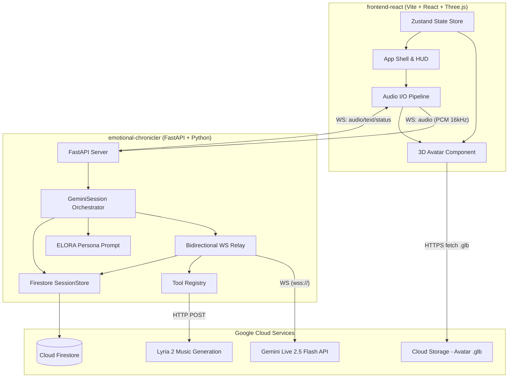

# 📘 Repository Info — The Emotional Chronicler

> A real-time, 3D-animated AI storyteller that perceives user emotions and physical surroundings to generate personalized, cinematic narratives with AI-generated music.

**Competition:** Google Hackathon (Hackathon Edition v1.0)

---

## 🗺️ High-Level Architecture



---

## 📁 Directory Structure

```
gemini-storyteller/
├── emotional-chronicler/          ← Python backend (FastAPI)
│   ├── main.py                    ← Entrypoint: uvicorn main:app --port 3001
│   ├── requirements.txt           ← Python dependencies
│   ├── .env                       ← GCP project/location/port config
│   └── app/
│       ├── __init__.py            ← Exports create_app()
│       ├── config.py              ← Environment config & Vertex AI URL builders
│       ├── core/
│       │   ├── auth.py            ← Google OAuth2 token acquisition
│       │   ├── session.py         ← GeminiSession lifecycle orchestrator
│       │   ├── relay.py           ← Bidirectional WebSocket relay logic
│       │   └── store.py           ← Firestore SessionStore (memory layer)
│       ├── server/
│       │   ├── factory.py         ← FastAPI app factory (create_app)
│       │   ├── middleware.py      ← CORS middleware setup
│       │   └── routes.py          ← HTTP & WebSocket route handlers
│       ├── tools/
│       │   ├── base.py            ← BaseTool ABC (abstract tool interface)
│       │   ├── __init__.py        ← ToolRegistry with auto-discovery
│       │   ├── lyria.py           ← LyriaTool: AI music generation via Vertex AI
│       │   └── google_search.py   ← GoogleSearchTool: built-in Gemini grounding
│       └── prompts/
│           └── elora.py           ← ELORA system prompt (~259 lines)
│
├── frontend-react/                ← React frontend (Vite + TypeScript)
│   ├── index.html                 ← HTML shell
│   ├── package.json               ← Dependencies & scripts
│   ├── vite.config.ts             ← Vite configuration
│   ├── tsconfig.json              ← TypeScript project references
│   └── src/
│       ├── main.tsx               ← React DOM root
│       ├── App.tsx                ← Root component: header, HUD, emotion controls
│       ├── App.css                ← Cinematic design system (glassmorphism)
│       ├── index.css              ← Base reset
│       ├── components/
│       │   ├── Scene.tsx          ← Three.js Canvas: lighting, particles, shadows
│       │   ├── Avatar.tsx         ← 3D avatar: bones, morphs, lip-sync, emotions
│       │   ├── AvatarHUD.tsx      ← Floating control HUD: button, waveform, status
│       │   └── PostFX.tsx         ← Post-processing: Bloom + Vignette
│       ├── hooks/
│       │   └── useStoryteller.ts  ← WebSocket + audio capture/playback pipeline
│       └── store/
│           └── useAvatarStore.ts  ← Zustand store: action, emotion, lipSyncVolume
│
├── cors.json                      ← GCS CORS configuration
├── docx_content.txt               ← Original project documentation
└── venv/                          ← Python virtual environment
```

---

## 🔧 Backend Deep Dive

### Tech Stack

| Layer        | Technology                           | Version   |
| ------------ | ------------------------------------ | --------- |
| Framework    | FastAPI                              | ≥ 0.115.0 |
| ASGI Server  | Uvicorn                              | ≥ 0.32.0  |
| AI Agent Kit | Google ADK                           | ≥ 1.0.0   |
| Auth         | google-auth                          | ≥ 2.35.0  |
| Database     | google-cloud-firestore               | ≥ 2.19.0  |
| AI Model     | Gemini Live 2.5 Flash (native audio) | —         |
| Music Model  | Lyria 002                            | —         |
| Env Config   | python-dotenv                        | ≥ 1.0.0   |

### Environment Variables (`.env`)

| Variable                    | Value                     | Purpose                 |
| --------------------------- | ------------------------- | ----------------------- |
| `GOOGLE_CLOUD_PROJECT`      | `gemini-liveagent-488913` | GCP project ID          |
| `GOOGLE_CLOUD_LOCATION`     | `us-central1`             | Vertex AI region        |
| `GOOGLE_GENAI_USE_VERTEXAI` | `TRUE`                    | Force Vertex AI backend |
| `PORT`                      | `3001`                    | Server port             |

### Entrypoint — `main.py`

- Loads `.env` via `python-dotenv`
- Configures structured logging to stdout
- Imports `create_app()` from `app` package
- Exposes `app` for Uvicorn: `uvicorn main:app --port 3001 --reload`

### Configuration — `app/config.py`

- **`FRONTEND_DIR`**: Points to `../frontend-react/dist` for serving static build
- **`GEMINI_LIVE_MODEL`**: `"gemini-live-2.5-flash-native-audio"`
- **`get_gemini_ws_url()`**: Builds Vertex AI WebSocket URL:
  `wss://{LOCATION}-aiplatform.googleapis.com/ws/google.cloud.aiplatform.v1beta1.LlmBidiService/BidiGenerateContent`
- **`get_model_resource_name()`**: Full resource path:
  `projects/{PROJECT_ID}/locations/{LOCATION}/publishers/google/models/{MODEL}`

### Server Layer — `app/server/`

#### `factory.py` — App Factory Pattern

- Validates `GOOGLE_CLOUD_PROJECT` is set (exits with error if missing)
- Lifespan context manager logs startup config banner
- Mounts static files from `FRONTEND_DIR`
- Attaches CORS middleware and API router

#### `middleware.py`

- Permissive CORS: all origins (`*`), all methods, all headers

#### `routes.py`

- **`GET /`** → Serves `index.html` from frontend build
- **`WS /ws`** → WebSocket endpoint:
  - Accepts optional `?user_id=` query param (or generates UUID)
  - Creates a `GeminiSession` per connection using the singleton `tool_registry`

### Core — `app/core/`

#### `auth.py` — Google OAuth2

- Uses Application Default Credentials
- Scoped to `cloud-platform` for Vertex AI access
- Returns fresh OAuth2 bearer token

#### `session.py` — `GeminiSession` (Central Orchestrator)

The session lifecycle is:

```
1. Create Firestore session (SessionStore.create_session)
2. Get OAuth2 access token (auth.get_access_token)
3. Connect to Gemini Live API via WebSocket (WSS + Bearer token)
4. Send BidiGenerateContentSetup message:
   - Model resource name
   - System instruction (ELORA prompt + previous session memory)
   - Tool declarations (from ToolRegistry)
   - Generation config: AUDIO + TEXT response modalities
   - Voice: "Aoede" preset
5. Run bidirectional relay (asyncio.gather):
   - relay_gemini_to_client (Gemini → Browser)
   - relay_client_to_gemini (Browser → Gemini)
6. Cleanup: end Firestore session, close Gemini WS
```

#### `relay.py` — Bidirectional WebSocket Relay

**Gemini → Client (`relay_gemini_to_client`):**

| Gemini Event                                 | Action                                                                        |
| -------------------------------------------- | ----------------------------------------------------------------------------- |
| `setupComplete`                              | Send `{type: "status", status: "ready"}` to browser                           |
| `toolCall`                                   | Dispatch via registry → send `toolResponse` back to Gemini → log to Firestore |
| `serverContent.inputTranscript`              | Log user speech to Firestore + send as `transcript` to browser                |
| `serverContent.modelTurn.parts[].inlineData` | Forward audio chunks to browser                                               |
| `serverContent.modelTurn.parts[].text`       | Log ELORA's text to Firestore + send as `transcript` to browser               |
| `serverContent.turnComplete`                 | Send `{type: "status", status: "turn_complete"}`                              |

**Client → Gemini (`relay_client_to_gemini`):**

- Receives `{type: "audio", data: "<base64>"}` from browser
- Wraps as `realtimeInput.mediaChunks` with `audio/pcm;rate=16000`
- Sends to Gemini WebSocket

#### `store.py` — `SessionStore` (Firestore Memory Layer)

**Firestore Schema:**

```
sessions/
  └── {user_id}/
      └── conversations/
          └── {session_id}/
              ├── created_at: timestamp
              ├── updated_at: timestamp
              ├── status: "active" | "ended"
              └── interactions: [
                    { role: "user"|"elora"|"tool", text/name/args, timestamp }
                  ]
```

**Key Methods:**

- `create_session()` → New session doc with UUID hex[:12]
- `log_interaction(role, text)` → ArrayUnion append
- `log_tool_call(name, args)` → ArrayUnion append with `role: "tool"`
- `end_session()` → Set `status: "ended"`
- `get_previous_context()` → Query last ended session, format last 20 interactions as narrative memory injected into ELORA's prompt

**Resilience:** Gracefully degrades if Firestore is unavailable — logs warnings but doesn't crash.

### Tools — `app/tools/`

#### Auto-Discovery System (`__init__.py`)

`ToolRegistry` scans all `.py` modules in `app/tools/`, finds `BaseTool` subclasses via reflection, and instantiates them automatically. No manual registration needed.

**API:**

- `get_declarations()` → List of tool dicts for Gemini setup message
- `dispatch(name, **kwargs)` → Execute matching tool, skip built-ins

#### `base.py` — `BaseTool` (ABC)

| Property/Method                          | Purpose                                        |
| ---------------------------------------- | ---------------------------------------------- |
| `name` (abstract property)               | Unique dispatch key                            |
| `declaration` (abstract property)        | Gemini-format tool declaration dict            |
| `execute(**kwargs)` (abstract)           | Run tool, return result dict                   |
| `is_builtin` (property, default `False`) | If `True`, Gemini handles execution internally |

#### `lyria.py` — `LyriaTool` (Music Generation)

- **Name:** `generate_music`
- **Model:** Lyria 002 on Vertex AI
- **Parameters:** `prompt` (required), `negative_prompt` (optional)
- **Flow:** OAuth2 token → HTTP POST to Vertex AI predict endpoint → Returns base64 WAV audio
- **Timeout:** 120 seconds
- **Returns:** `{audio_content, mime_type, duration_seconds: 33, description}`

#### `google_search.py` — `GoogleSearchTool`

- **Name:** `google_search`
- **Built-in:** `True` (Gemini handles internally)
- **Declaration:** `{"googleSearch": {}}`
- No local execution — just ensures the declaration is in the setup message

### Prompts — `app/prompts/elora.py`

The **ELORA system prompt** (~259 lines, ~18KB) defines the AI storyteller persona with:

1. **Persona:** Ancient, ethereal storyteller — warm, dramatic, theatrical
2. **Director Mindset:** Thinks like Spielberg + Miyazaki + Hitchcock; controls pacing, tension, music cues
3. **Voice Style:** Mystical bard crossed with warm grandmother; tone shifts with story mood
4. **Role:** Greets users warmly, crafts personalized stories, adapts real-time, makes user the hero
5. **Abilities:**
   - 🔍 `google_search` — Grounding in real-world knowledge
   - 🎵 `generate_music` — Cinematic scoring with detailed composition guidance
   - 🎨 `generate_image` — Scene illustration (declared but not yet implemented as a tool)
6. **Cinematic Scoring Masterclass:** Extensive guidance on when/how to trigger music:
   - The Overture, Emotional Turn, Climax, Quiet After Storm, Wonder, Pursuit, Farewell, Battle Cry
   - Music timing principles: silence before big moments, 2-4 cues per arc
7. **Storytelling Rules:** Never break character, no bullet points, three-act structure, cliffhangers

---

## 🎨 Frontend Deep Dive

### Tech Stack

| Layer             | Technology                  | Version  |
| ----------------- | --------------------------- | -------- |
| Framework         | React                       | ^19.2.0  |
| Build Tool        | Vite                        | ^7.3.1   |
| Language          | TypeScript                  | ~5.9.3   |
| 3D Engine         | Three.js                    | ^0.183.2 |
| 3D React Bindings | @react-three/fiber          | ^9.5.0   |
| 3D Helpers        | @react-three/drei           | ^10.7.7  |
| Post-Processing   | @react-three/postprocessing | ^3.0.4   |
| State Management  | Zustand                     | ^5.0.11  |

### Design System (CSS)

- **Fonts:** Cinzel (dramatic serif for titles) + Inter (clean sans-serif for body)
- **Color Palette:**
  - `--space: #050510` (deep background)
  - `--purple: #7c3aed` / `--purple-lt: #a78bfa` (primary)
  - `--teal: #06b6d4` / `--teal-lt: #67e8f9` (accent)
  - `--gold: #f59e0b` (speaking state)
- **Effects:** Glassmorphism (blur + translucent backgrounds), scanline overlay, gradient title text, animated gem pulse

### Component Architecture

#### `App.tsx` — Root Component

- Title badge (top-left, glassmorphic)
- Connection status dot (top-right, color-coded by state)
- `<AvatarHUD>` — Floating talk button (center-bottom)
- Dev emotion controls (bottom-left): 😐 😊 😢 😲
- 3D `<Scene>` is imported but **currently disabled** (commented out)

#### `Scene.tsx` — Three.js Canvas

- **Lighting:** 4-point cinematic setup (key, rim, fill, ground bounce)
- **Environment:** City preset HDRI for reflections
- **Particles:** Purple + teal sparkles for magical atmosphere
- **Shadows:** `ContactShadows` on the ground plane
- **Controls:** `OrbitControls` (pan/zoom disabled, limited polar angle)
- **Post-processing:** Via `PostFX` component

#### `Avatar.tsx` — 3D Character (~302 lines)

**Asset:** `.glb` model from Google Cloud Storage:

```
https://storage.googleapis.com/storyteller-avatars/69a498bf2b9bcc76d542b064.glb
```

**Features:**

1. **Entrance Animation:** Slides in from left (`x: -7 → 0`) with cubic ease-out over 1.8s
2. **Wave Gesture:** After arrival, right arm waves for 2.2s then returns to rest
3. **Procedural Breathing:** Spine oscillates subtly on every frame
4. **Head Mouse Tracking:** Head bone follows pointer position smoothly
5. **Morph Target Emotions:**
   - `happy` → mouthSmile + browInnerUp
   - `sad` → browInnerUp + mouthFrown + mouthPucker
   - `surprised` → jawOpen + browOuterUp + eyeWide
   - `neutral` → all lerp to zero
6. **Automatic Blinking:** Random interval (2.5–6.5s), sine-wave blink curve
7. **Real-Time Lip Sync:** `jawOpen` morph driven by `lipSyncVolume` from audio analysis
8. **Teeth Sync:** Mirrors jaw morph to teeth mesh

**Bone Detection:** Auto-discovers bones by regex pattern (Spine, Head, RightArm, LeftArm, etc.)
**Morph Detection:** Multi-name lookup for compatibility across RPM model versions

#### `AvatarHUD.tsx` — Floating Control Panel

- **Status-aware button** with ripple ring animation and contextual icons:
  - Idle → Mic icon + "Talk to Elora"
  - Connecting → Spinner + "Awakening…"
  - Listening → Wave icon + "End Session"
  - Speaking → Sound icon + "End Session"
- **Waveform Bars:** 10-bar visualization during speaking state
- **Status Badge:** Color-coded orb + label (only visible when active)

#### `PostFX.tsx` — Post-Processing Effects

- **Bloom:** `luminanceThreshold: 0.15`, `intensity: 1.2`
- **Vignette:** `offset: 0.4`, `darkness: 0.8`

### State Management — `useAvatarStore.ts`

Zustand store with:

- `currentAction`: `'Idle' | 'Speaking' | 'Listening'`
- `currentEmotion`: `'neutral' | 'happy' | 'sad' | 'surprised'`
- `lipSyncVolume`: `number` (0–1, drives jaw morph)

### Audio Pipeline — `useStoryteller.ts` (~297 lines)

**6-state machine:** `disconnected → connecting → connected → listening → speaking → error`

**Microphone Capture (Client → Server):**

1. `getUserMedia` with mono, 16kHz ideal, echo/noise cancellation
2. `ScriptProcessorNode` (4096 buffer) on each audio process event:
   - Downsample from native rate to 16kHz (linear interpolation)
   - Float32 → Int16 PCM conversion
   - Base64 encode
   - Send as `{type: "audio", data}` over WebSocket

**Audio Playback (Server → Client):**

1. Receive `{type: "audio", data}` from server
2. Base64 → Int16 → Float32 conversion
3. Create `AudioBuffer` at 24kHz playback rate
4. Schedule via `AudioBufferSourceNode.start()` with gapless timing
5. Route through `AnalyserNode` for frequency analysis
6. `requestAnimationFrame` loop reads frequency data → normalizes to 0–1 volume → pushes to `lipSyncVolume` in Zustand store

**WebSocket Messages Handled:**

| Server Message                              | Frontend Action                                       |
| ------------------------------------------- | ----------------------------------------------------- |
| `{type: "status", status: "connected"}`     | Set state to `connected`                              |
| `{type: "status", status: "ready"}`         | Set state to `listening`, avatar → Idle               |
| `{type: "status", status: "turn_complete"}` | Set state to `listening`, avatar → Idle               |
| `{type: "audio", data, mimeType}`           | Set state to `speaking`, avatar → Talking, play audio |
| `{type: "tool_event", name}`                | Log to console                                        |
| `{type: "error", message}`                  | Set state to `error`                                  |

**Image Upload (unused in UI currently):**

- `sendImage(file)` → FileReader → base64 → send as `{type: "image", mimeType, data}`

---

## 🔄 Data Flow Summary

```
User speaks into mic
  → Browser captures PCM audio @ 16kHz
  → Base64 encode → WS to FastAPI (/ws)
  → FastAPI relay → Gemini Live API (WSS)
  → Gemini processes:
      - Speech-to-text (inputTranscript)
      - Story reasoning (ELORA persona + memory)
      - Tool calls (generate_music, google_search)
  → Gemini responds:
      - Audio (ELORA's voice, "Aoede")
      - Text (narration transcript)
      - Tool calls (function calling)
  → FastAPI relay → Browser via WS
  → Browser plays audio @ 24kHz
  → AnalyserNode → lipSyncVolume → Avatar jaw morph
  → Firestore logs all interactions for session memory
```

---

## 🚀 How to Run

### Backend

```bash
cd emotional-chronicler
pip install -r requirements.txt
# Ensure .env has valid GCP credentials
uvicorn main:app --port 3001 --reload
```

### Frontend

```bash
cd frontend-react
npm install
npm run dev     # Dev server on http://localhost:5173
npm run build   # Production build to dist/
```

### Access

- **Frontend Dev:** `http://localhost:5173`
- **Backend API Docs:** `http://localhost:3001/docs`
- **WebSocket:** `ws://localhost:3001/ws?user_id=<optional>`

---

## ⚠️ Current State & Notes

1. **3D Scene disabled:** `<Scene />` is commented out in `App.tsx` — only the HUD and 2D UI render
2. **`generate_image` tool referenced in ELORA prompt** but not yet implemented as a `BaseTool` subclass
3. **ScriptProcessorNode deprecation:** Frontend uses `ScriptProcessorNode` instead of `AudioWorklet` (works but deprecated)
4. **Hardcoded WS URL:** Frontend connects to `ws://localhost:3001/ws` — needs env-based config for production
5. **No Veo integration yet:** Project docs mention Veo 3.1 for video generation, but no tool or code exists for it
6. **CORS wide open:** `allow_origins=["*"]` — fine for dev, needs tightening for production
